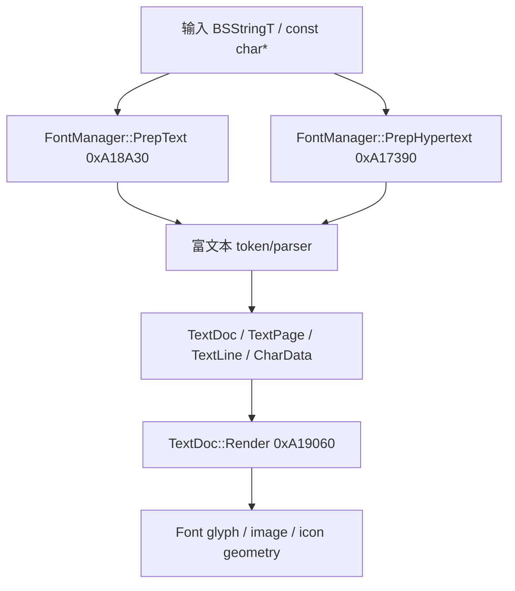
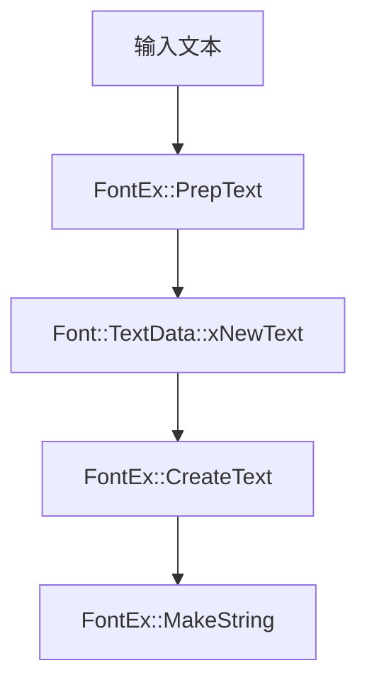

# 富文本多字节/UTF-8 Hook 设计文档

本文记录 Fallout: New Vegas 正式版与 Xbox 测试版逆向得到的富文本显示管线，并给出在 tNVSE 中为该管线补充多字节/UTF-8 文本支持的实现方案。目标是让普通文本路径与富文本路径都能使用同一套 CJK 字体扩展数据，避免 UTF-8 转换、自动换行、分页和最终渲染阶段拆开 DBCS 字节。

## 1. 范围与当前状态

tNVSE 当前已经覆盖了普通 `Font` 文本路径：

| 路径 | 正式版地址 | 当前 tNVSE 状态 |
| --- | ---: | --- |
| `Font::Font` / 初始化 | `0xA12020` | `WriteRelJumpEx(0xA12020, &FontEx::FontInit)` |
| `Font::Load` | `0xA15320` | `WriteRelJumpEx(0xA15320, &FontEx::Load)` |
| `Font::PrepText` | `0xA12FB0` | `WriteRelJumpEx(0xA12FB0, &FontEx::PrepText)` |
| Terminal `PrepTextForTerminal` call site | `0x759281` | `WriteRelCallEx(0x759281, &FontEx::PrepTextForTerminal)` |
| `Font::CreateText` | `0xA12880` | `WriteRelJumpEx(0xA12880, &FontEx::CreateText)` |
| `Font::MakeString` | `0xA12460` | `WriteRelJumpEx(0xA12460, &FontEx::MakeString)` |
| `FontManager::CalculateStringDimensions` | `0xA1B020` | `WriteRelJumpEx(0xA1B020, &FontManagerEx::CalculateStringDimensions)` |

但富文本路径仍未真正接管：

| 路径 | 正式版地址 | 当前 tNVSE 状态 |
| --- | ---: | --- |
| `FontManager::PrepText` | `0xA18A30` | `WriteRelCallEx(0xA18F4A, &FontManagerEx::PrepText)` call site 重定向；内部包 UTF-8 转换后调原版 `0xA18A30` |
| `FontManager::PrepHypertext` | `0xA17390` | `WriteRelCallEx(0xA18ACC, &FontManagerEx::PrepHypertext)` call site 重定向；内部包 UTF-8 转换后调原版 `0xA17390` |
| `FontManager::CollectTo` | `0xA16EA0` | 未 hook；直接 hook 返回 `BSStringT<char>` 的 call site 已因 ABI/临时对象风险回退，目前只保留输入扫描日志 |
| `TextDoc::Render` | `0xA19060` | `WriteRelCallEx(0xA18F63, &FontManagerEx::TextDocRender)`；内部 `BeginRichTextRenderContext` + 原版 `0xA19060` + `EndRichTextRenderContext` |
| `TextDoc::Render` 字符发射点 | `0xA19622` | `WriteRelCallEx(0xA19622, &FontEx::TextDocRenderAddChar)`；DBCS 改用扩展 glyph |
| `TextDoc::~TextDoc` | `0xA1B990` | `WriteRelCallEx(0xA18F7D, &FontManagerEx::TextDocDestroy)`；清理 side table 后调原版析构 |
| `TextDoc::AddChar` | `0xA19A10` | `WriteRelCallEx` 4 处 call site 重定向；DBCS lead/trail 合并 + side table 登记 + CJK 零宽断行标记 |
| `TextPage::AddChar` | `0xA19C00` | **未 hook**（`iLastFontHeight` 仍按 lead byte 计算，待评估） |
| `TextLine::AddChar` | `0xA19F70` | 未 hook；通过 DBCS 后置零宽 space 断点复刻普通 `FontEx::PrepText` 的 CJK 字符边界换行，避免原版 hyphen 分支 |
| `CharData::Copy` | `0xA1B660` | **未 hook**（依赖合并机制绕过 Copy，待 IDA 核对） |

详见第 12 节"当前实现进度"。

## 2. 逆向依据

### 2.1 正式版函数

以下地址来自 PC 正式版 `FalloutNV.exe`：

| 函数 | 地址 | 作用 |
| --- | ---: | --- |
| `FontManager::PrepHypertext` | `0xA17390` | 富文本/超文本入口之一，解析带链接或文档语义的文本 |
| `FontManager::PrepText` | `0xA18A30` | 富文本普通入口，构造 `TextDoc`/页面/行/字符数据 |
| `TextDoc::Render` | `0xA19060` | 遍历 `TextDoc` 生成实际可见几何 |
| `FontManager::CalculateStringDimensions` | `0xA1B020` | 字符串尺寸计算，当前已有 DBCS 处理 |
| `FontManager::GetLinePadding` | `0xA1B3A0` | 取字体行距补偿，当前通过 `FontManager::GetLinePadding` 包装调用 |

富文本内部 helper：

| 函数 | 地址 | 作用 |
| --- | ---: | --- |
| `FontManager::GetCharType` | `0xA16DA0` | 富文本 tokenizer 对单字节分隔符分类 |
| `FontManager::CollectTo` | `0xA16EA0` | 从输入缓冲收集普通文本、tag 名、属性名、属性值 |
| `FontManager::TextDoc::CurrentPage` | `0xA18FF0` | 按 `TextDoc::iPageNum` 返回当前页 |
| `FontManager::TextDoc::AddChar` | `0xA19A10` | 把 `CharData` 加到当前 `TextPage`，必要时创建新页 |
| `FontManager::TextPage::GetCharCountForFont` | `0xA19B00` | 统计某页内指定字体的非图片字符数 |
| `FontManager::TextPage::AddChar` | `0xA19C00` | 把 `CharData` 加到当前行，处理分页高度 |
| `FontManager::TextLine::AddChar` | `0xA19F70` | 行宽、自动换行、尾部字符搬移和 hyphen 插入 |
| `FontManager::CharData::CharData` | `0xA1B450` | 初始化单个字符节点 |
| `FontManager::CharData::Copy` | `0xA1B660` | 复制 `CharData` 并分配 `0x38` 字节 |
| `FontManager::CharData::RevertToDefault` | `0xA1B770` | 恢复默认字体、颜色、对齐和空格字符 |
| `FontManager::CharData::SetChar` | `0xA1B7F0` | 写入 `cChar` 并按 `pFontLetters[cChar]` 刷新度量 |
| `FontManager::TextPage::TextPage` | `0xA1BC70` | 初始化 `TextPage` 并添加首字符 |

相关底层行为：

- `ConvertToAsciiQuotes 0xA122B0` 会将 Windows smart quotes 转为 ASCII quotes。富文本 parser 对 ASCII 字节调用它是合理的，但不能对 DBCS trail byte 单独调用。
- `AlignLineWidthToTab 0xEC9130` 等价于 `fmod(currentWidth, tabWidth)` 风格的 x87/CRT remainder。正式版 tab 行宽逻辑不是整数 `%`，富文本实现要维持相同行为。
- 富文本路径创建的 `TextDoc` 是独立文档模型，和普通 `Font::TextData` 的 `xLineWidths`/`xNewText` 管线不同。

### 2.2 测试版 PDB 命名与正式版结构

`ui_decode.h` 中的富文本结构字段名来自 2010-08-22 Xbox Release Beta PDB，offset 已按 PC 正式版校验。

`FontManager::TextData`，大小 `0x40`：

| Offset | 字段 | 说明 |
| ---: | --- | --- |
| `00` | `iDefaultFont` | 默认字体 |
| `04` | `iJustification` | `1=left`, `2=center`, `4=right` |
| `08` | `xColor` | 默认颜色 |
| `18` | `cLineSep` | 换行分隔符 |
| `1C` | `iWidth` | 页面/文本宽度 |
| `20` | `iHeight` | 页面/文本高度 |
| `24` | `iPageNum` | 当前页 |
| `28` | `iLines` | 行数限制/请求值 |
| `2C` | `iNumPages` | 输出页数 |
| `30` | `iNumLines` | 输出行数 |
| `34` | `bIsHypertext` | 是否超文本路径 |
| `38` | `xNewText` | 处理后的文本 |

`FontManager::CharData`，大小 `0x38`：

| Offset | 字段 | 说明 |
| ---: | --- | --- |
| `00` | `iFontIndex` | 字体索引，沿用原版语义 |
| `04` | `cChar` | 原版单字节字符 |
| `05` | `pad05[3]` | 原版 padding；tNVSE 不在这里保存私有状态 |
| `08` | `xColor` | 字符颜色 |
| `18` | `iJustification` | 对齐方式 |
| `1C` | `xFilename` | 非空时表示 `IMG`/`SRC` 图片项，不应按字符渲染 |
| `24` | `iWidth` | 字符或图片宽度 |
| `28` | `iRise` | baseline 上升 |
| `2C` | `iDrop` | baseline 下降 |
| `30` | `iLeadingEdge` | leading edge |
| `34` | `iX` | 行内 X 位置 |

`FontManager::TextLine`，大小 `0x30`：

| Offset | 字段 | 说明 |
| ---: | --- | --- |
| `00` | `xChars` | `CharData*` 列表 |
| `0C` | `iWidth` | 行宽 |
| `10` | `iNextSpacing` | 下一字符间距/尾随 spacing |
| `14` | `iRise` | 行最大 rise |
| `18` | `iDrop` | 行最大 drop |
| `1C` | `iSkippedSpace` | 换行时跳过的空格宽度 |
| `20` | `iJustify` | 行对齐 |
| `24` | `iPageWidth` | 页宽 |
| `28` | `unk28` | 未完全确认 |
| `2C` | `pPage` | 所属页 |

`FontManager::TextPage`，大小 `0x44`：

| Offset | 字段 | 说明 |
| ---: | --- | --- |
| `00` | `xLines` | `TextLine*` 列表 |
| `0C` | `iWidth` | 页面最宽行 |
| `10` | `iHeight` | 页面高度 |
| `14` | `iPageWidth` | 页宽 |
| `18` | `iPageHeight` | 页高 |
| `1C` | `iLastFontHeight` | 上次字体高度 |
| `20` | `pCharsPerFont[8]` | 每个字体的字符计数 |
| `40` | `pDoc` | 所属文档 |

`FontManager::TextDoc`，大小 `0x18`：

| Offset | 字段 | 说明 |
| ---: | --- | --- |
| `00` | `xPages` | `TextPage*` 列表 |
| `0C` | `iPageWidth` | 页宽 |
| `10` | `iPageHeight` | 页高 |
| `14` | `iPageNum` | 页号 |

### 2.3 IDA 反编译得到的管线行为

本节基于 IDA 9.3 对 PC 正式版 IDB 副本和 Xbox 测试版 PDB IDB 的导出结果，用来约束后续 hook 的实际落点。

#### 2.3.1 `FontManager::PrepText 0xA18A30`

正式版 `PrepText` 行为可以归纳为：

1. `BSStringT<char>::pString == nullptr` 时直接返回 `nullptr`。
2. `TextData::iWidth` 或 `iHeight` 小于 `2` 时改为 `0x7FFFFFFF`，表示近似无限宽/高。
3. 先调用 `FontManager::PrepHypertext 0xA17390`。如果返回非空 `TextDoc*`，`PrepText` 直接返回该文档。
4. 若不是 hypertext，则分配 `0x18` 字节的 `TextDoc`，写入 `iPageWidth/iPageHeight/iPageNum`。
5. 在栈上构造默认 `CharData`，再按 `TextData` 写入默认字体、颜色和 justification。
6. 循环主体是单字节：

```cpp
for (i = 0; i < textLen; ++i)
{
    acChar = text->pString[i];
    ConvertToAsciiQuotes(&acChar);

    if (acChar == data->cLineSep)
        ++aiNewLines;
    else if (acChar == '\t' || acChar >= 0x20)
    {
        CharData::SetChar(&current, acChar);
        CharData* copy = current.Copy();
        doc->AddChar(copy, aiNewLines, false);
        aiNewLines = 0;
    }
}
```

因此 `PrepText` 的正式版缺陷不是单独一个渲染点，而是输入 cursor、quote 转换、换行计数、`CharData::SetChar` 和 `TextDoc::AddChar` 都把一个 `char` 当成一个可见字符。DBCS lead/trail 在这里会被拆成两个 `CharData`。

函数结束时会重写 `TextData` 输出字段：

- `bIsHypertext = 0`
- `iNumPages = doc->xPages.m_kAllocator.m_uiCount`
- `iWidth/iHeight` 来自当前页行宽和行高累计
- `iNumLines` 来自当前页 `xLines` 计数

#### 2.3.2 `FontManager::PrepHypertext 0xA17390`

`PrepHypertext` 是一个更完整的富文本 parser。它先复制输入到临时缓冲，然后用 `CollectTo` 和 `GetCharType` 分段读取文本、tag、属性名和属性值。确认进入 hypertext 后同样分配 `0x18` 字节 `TextDoc`，并设置 `TextData::bIsHypertext = 1`。

关键行为：

- 普通文本段来自 `CollectTo` 结果，随后逐字节循环：

```cpp
for (i = 0; i < collectedTextLen; ++i)
{
    CharData::SetChar(&current, collectedText[i]);
    if (current.cChar == 1)
        current.iWidth = ButtonIcons[nextIcon].fWidth + ButtonIcons[nextIcon].fSpacing;
    doc->AddChar(current.Copy(), pendingNewLines, pendingNewPage);
}
```

- tag 和属性会被转为大写后比较，例如 `IMG`, `SRC`, `WIDTH`, `HEIGHT`, `DIV`, `FONT`, `FACE`, `COLOR`, `ALIGN`, `LEFT`, `CENTER`, `RIGHT`, `BR`, `P`, `HR`, `/FONT`。
- `IMG SRC` 会通过 `xFilename` 表示图片项，图片项后续不走 `pFontLetters[cChar]`。
- `WIDTH` 写 `CharData::iWidth`，`HEIGHT` 写 `iRise` 并把 `iDrop` 置 `0`。
- `FACE` 通过字体文件名或数字切换 `iFontIndex`。
- `COLOR` 解析 6 位十六进制 RGB 并写 `xColor`。
- `ALIGN` 改 `iJustification`，`BR/P/HR` 改 pending newline/new page 状态，`/FONT` 调 `CharData::RevertToDefault`。

这个函数的危险点比 `PrepText` 更多：不仅普通文本段按单字节循环，`CollectTo` 本身也按单字节识别 `<`, `>`, `{`, `}`, `=`, quote、空白和 `\0`。如果 DBCS trail byte 等于这些 ASCII 分隔符，parser 会在字节中间切开 token。

#### 2.3.3 `GetCharType 0xA16DA0` 与 `CollectTo 0xA16EA0`

`GetCharType(char)` 返回的是 bitmask：

| 字符 | 返回值 | 语义 |
| --- | ---: | --- |
| `'\0'` | `0x20` | 结束 |
| `'<'`, `'{'` | `0x01` | open delimiter |
| `'>'`, `'}'` | `0x02` | close delimiter |
| `'"'`, `'\''` | `0x08` | quote |
| `'='` | `0x10` | assignment |
| `<= 0x20` | `0x04` | 空白/控制字符 |
| 其他 `> 0x20` | `0x00` | 普通字符 |

`CollectTo` 每轮读取 `input[index]`，立刻调用 `GetCharType`。当启用实体替换时，它还会按单字节扫描 `&...;`，通过 `Interface::FindTextReplacementString` 替换 GameSetting 文本或调用 `Font::AddTextIcon` 生成 icon 字符 `1`。

对 DBCS/UTF-8 hook 来说，这意味着：

- 不能只在 `PrepHypertext` 的普通文本循环里处理 DBCS；`CollectTo` 级别也必须 DBCS-aware。
- tag 内部仍应保持 ASCII 语法，但普通文本段中遇到 DBCS lead 后，trail byte 不允许再参与 delimiter 判断。
- `&...;` 实体扫描必须只在 ASCII `&` 开始时启用；DBCS trail byte 为 `0x26` 时不能进入实体逻辑。

#### 2.3.4 `CharData` helper 的实际副作用

`CharData::CharData 0xA1B450`：

- 分配/初始化结构大小为 `0x38`。
- 写 `iFontIndex`、`cChar`、`xColor`、`iJustification`、`xFilename`。
- 用 `pFont[iFontIndex]->pFontData->pFontLetters[cChar]` 计算 `iWidth/iRise/iDrop/iLeadingEdge/iX`。
- 不初始化 `pad05[3]`。

`CharData::SetChar 0xA1B7F0`：

- 写 `cChar = acChar`。
- 如果 `xFilename` 为空，则用 `pFontLetters[cChar]` 刷新 `iWidth/iRise/iDrop`。
- 最后把 `iX` 置 `0`。
- 不清理 `pad05[3]`。

`CharData::Copy 0xA1B660`：

- `MemoryManager::Allocate(0x38)`。
- 调 `CharData::CharData(newChar, this->iFontIndex, this->cChar, this->xColor, this->iJustification)`。
- 复制 `xFilename`、`iWidth`、`iRise`、`iDrop`、`iX`。
- 将 `iLeadingEdge` 置 `0`。
- 不复制 `pad05[3]`。

这点非常关键：`pad05[3]` 不是稳定的业务字段，原版 constructor、`SetChar` 和 `Copy` 都不保证它的内容。tNVSE 不应把 DBCS trail byte 或 flag 写进 `pad05`，否则会同时遇到两个问题：原版 `Copy` 丢失扩展状态，以及未初始化 padding 被误判为 tNVSE 标记。

富文本 DBCS 状态应使用外部 side table 保存，例如 `CharData* -> RichTextCharExtra`。DBCS 分支在得到最终 heap `CharData*` 后登记 side table；ASCII、图片、icon 路径不登记。若 `CharData` 经过 `Copy` 或 layout 迁移，wrapper 必须同步迁移 side table 关联，而不是修改原结构体 padding。

#### 2.3.5 `TextDoc`/`TextPage`/`TextLine` layout helper

`TextDoc::AddChar 0xA19A10`：

- 若文档没有页，或 `abNewPage != false`，分配 `0x44` 字节 `TextPage`。
- 否则调用当前尾页 `TextPage::AddChar(apChar, aiNewLines)`。
- 新页通过 `TextPage::TextPage 0xA1BC70` 初始化并加入 `xPages`。

`TextPage::AddChar 0xA19C00`：

- `aiNewLines > 1` 时把 `iLastFontHeight` 累加到 `iSkippedSpace`。
- 若当前页没有行或 `aiNewLines != 0`，分配 `0x30` 字节 `TextLine`。
- 否则调用尾行 `TextLine::AddChar`。
- 对非图片字符，用 `pFontLetters[cChar]` 更新 `iLastFontHeight`，再按 `iSkippedSpace + iRise + iHeight` 判断是否分页。
- 对非图片字符递增 `pCharsPerFont[iFontIndex]`。

`TextLine::AddChar 0xA19F70`：

- 优先用 `CharData::iWidth + line->iWidth <= line->iPageWidth` 判断能否加入当前行。
- 加入时直接使用 `CharData::iWidth/iRise/iDrop/iLeadingEdge/iX`，所以 DBCS 只要作为一个 `CharData` 进入，行宽计算可以复用原版大部分逻辑。
- 溢出且当前字符是 ASCII space (`cChar == 32`) 时，把该字符 `SetChar(0)` 后开新行。
- 溢出且行内存在 ASCII space 时，从行尾向前搬移 `CharData` 到新行，直到遇到 space，然后释放该 space。
- 溢出且行内没有 space 时，会分配一个 `'-'` 的 `CharData` 插入原行，再把尾部字符搬到新行。

因此只 hook `PrepText`/`PrepHypertext` 还不够严格：如果继续调用原版 `TextPage::AddChar`，DBCS 的 `iLastFontHeight` 仍会按 `pFontLetters[lead]` 计算；如果继续调用原版 `TextLine::AddChar`，CJK 无空格长行可能触发原版西文 hyphen 插入。可落地方案有两种：

1. 保留原版 `TextDoc::AddChar`/`TextPage::AddChar`/`TextLine::AddChar`，但 hook DBCS 分支涉及的 `TextPage::AddChar` 高度更新和 `TextLine::AddChar` 无空格换行策略。
2. 在 tNVSE 的富文本 parser 中直接构造 `TextDoc`/`TextPage`/`TextLine`，自行执行 DBCS-aware layout，只复用结构和渲染阶段。

#### 2.3.6 `TextDoc::Render 0xA19060`

正式版渲染阶段流程：

1. 根据 `TextDoc::iPageNum` 选择当前 `TextPage`。
2. 对 `fontIndex = 0..7` 调 `TextPage::GetCharCountForFont`，为每个有字符的字体调用 `Font::MakeTriShape 0xA14A20`。
3. 如果 `pFont[0]->ButtonIcons.uiSize` 非零，调用 `Font::MakeIconsTriShape 0xA14DA0`。
4. 遍历行，若 `TextData::bIsHypertext` 为真，则用 `TextDoc::iPageWidth` 参与 center/right 对齐。
5. 遍历 `CharData`：
   - `xFilename` 为空且 `cChar == 1`：调用 `Font::AddIcon 0xA14650`。
   - `xFilename` 为空且普通字符：调用 `Font::AddChar 0xA142D0`，参数里的 glyph 是 `&font->pFontData->pFontLetters[cChar]`。
   - `xFilename` 非空：调用 `FontManager::MakeImage 0xA1A800`。
6. 结束后计算 bounds、attach 到父 `NiNode`，并清空 `pFont[0]->ButtonIcons`。

DBCS 渲染 hook 的最小目标是第 5 步普通字符分支：当 `CharData` 带 tNVSE DBCS 标记时，不取 `pFontLetters[cChar]`，而是用 `extraGlyphs[(lead << 8) | trail]` 作为 `FontLetter*` 调 `Font::AddChar 0xA142D0`。

## 3. 富文本管线数据流

正式版富文本路径可以按以下阶段理解：



普通 `Font` 路径是：



两者最大差异是：普通路径在 `Font::TextData::xNewText` 内保存处理后的线性字符串；富文本路径则先构造 `TextDoc`，每个可见单元是一个 `CharData` 节点。因此只改 `FontEx::PrepText` 不会覆盖富文本文档。

## 4. 当前 tNVSE 编码与字体扩展机制

tNVSE 当前多字节机制由以下部分组成：

- `g_uiEncoding` 控制 UI 编码选项：`0=English`, `1=GBK`, `2=Big5`, `3=SJIS`, `4=UHC/CP949`。
- `g_usingWinEncoding` 保存 Windows codepage：`936`, `950`, `932`, `949`。
- `g_bEnableUTF8` 控制是否将 UTF-8 输入转换为当前 codepage。
- `ConvertToMultiByte` / `UTF8ToMultiByteStr` 负责 UTF-8 到 codepage 字节串转换。
- `TryDecodeDoubleByte` 根据当前 codepage 识别 DBCS 字符，并返回 `code = (lead << 8) | trail`。
- `gNumberedExtraLetters[fontID]` 保存扩展 `FontLetter` map，用于 CJK glyph 宽度和渲染。

普通路径已实现的关键行为：

- 读入扩展字体：`FontEx::LoadExtraGlyphs` 从字体文件 dense 扩展区读取 `0x81..0xFE x 0x40..0xFE` 的 `FontLetter`。
- 宽度计算：`FontManagerEx::CalculateStringDimensions` 对 DBCS 调 `TryDecodeDoubleByte`，用 `extraGlyphs[code]` 计算宽度。
- 文本准备：`FontEx::PrepText` 处理 DBCS cursor、自动换行和 `xLineWidths`。
- 渲染：`FontEx::CreateText` / `MakeString` 遇到 DBCS 时调用正式版 glyph 构造辅助函数，使用扩展 `FontLetter`。

富文本实现应复用上述编码 helper 和 extra glyph map，不应重新定义另一套 DBCS 范围。

## 5. 需要补齐的富文本 Hook

### 5.1 Hook 入口

富文本 hook 与普通 `Font` 管线 hook 同样采用 `WriteRelCallEx` call site 重定向 + `FontManagerEx` 成员函数的成熟风格，签名以正式版调用约定为准（已落地实现见 `font_manager.h`）：

```cpp
NiPoint3* __thiscall CalculateStringDimensions(NiPoint3* out, const char* src, UInt32 font, float wrap, UInt32 start);
BSStringT<char> __thiscall CollectTo(const char* apSource, UInt32* apIndex, UInt32 aiStopMask,
                                     bool abUseReplacements, UInt32* apOutType, char* apOutChar);
TextDoc* __thiscall PrepHypertext(BSStringT<char>& arTextString, TextData& arData);
TextDoc* __thiscall PrepText(BSStringT<char>& arTextString, TextData& arData);
void __thiscall TextDocRender(NiNode* apNode, TextData* apData);
void __thiscall TextDocDestroy();
void __thiscall TextDocAddChar_*(CharData* apChar, int aiNewLines, bool abNewPage);
```

文档阶段只锁定 hook 目标：

| Hook | 地址 | 目的 |
| --- | ---: | --- |
| `FontManager::PrepText` | `0xA18A30` | 接管普通富文本构建 |
| `FontManager::PrepHypertext` | `0xA17390` | 接管超文本构建，保留 link/hypertext 语义 |
| `TextDoc::Render` 或内部字符发射点 | `0xA19060` | 让 DBCS `CharData` 使用扩展 glyph 渲染 |
| `CharData::Copy` 或 DBCS copy wrapper | `0xA1B660` | 确保 `RichTextCharExtra` side table 关联不在复制时丢失 |
| `TextPage::AddChar` DBCS 分支 | `0xA19C00` | 修正 `iLastFontHeight` 对 `pFontLetters[lead]` 的错误依赖 |
| `TextLine::AddChar` DBCS 分支 | `0xA19F70` | 避免 CJK 无空格换行触发原版 hyphen 插入 |

如果 `TextDoc::Render` 整体重写风险过高，优先选择其内部“从 `CharData` 发射 glyph”的 call site 做局部 hook。局部 hook 的目标是：ASCII 仍走原版，图片项仍走原版；只有能在 side table 中查到 DBCS code 的 `CharData` 改走扩展 glyph。

如果富文本 parser 选择完全自行 layout，并且不调用原版 `TextPage::AddChar`/`TextLine::AddChar`，后两个 helper 可以不 hook；但此时必须自己完整维护 `TextLine::iWidth/iRise/iDrop/iSkippedSpace`、`TextPage::iHeight/iLastFontHeight/pCharsPerFont[8]` 和分页。

### 5.2 输入转换策略

富文本入口必须在解析 tag 前完成 UTF-8 到目标 codepage 的转换，但不能破坏原有富文本语法。**应当直接复用普通 `Font` 管线已封装的 `ConvertToMultiByte` 单调用模式，保持两条管线行为一致，不应在富文本侧重新组合 `g_bEnableUTF8` / `g_uiEncoding` / `IsValidUTF8With3ByteMin` 条件链。**

`encoding.h` 中 `ConvertToMultiByte(const char*& pSrc, std::string& outConverted, bool hasExtraGlyphs)` 已经封装了第 4 节的 `ShouldConvertUTF8(hasExtraGlyphs)`（即 `g_bEnableUTF8 && g_uiEncoding != 0 && hasExtraGlyphs`）和 `IsValidUTF8With3ByteMin` 判断。富文本入口只需：

```cpp
const char* parserText = arTextString.pString ? arTextString.pString : "";
std::string convertedTextStorage;
if (ConvertToMultiByte(parserText, convertedTextStorage, HasRichTextExtraGlyphs()))
{
    BSStringT<char> convertedText;
    if (convertedText.Set(parserText))
    {
        // 用转换后的 BSStringT<char> 调原版 PrepText/PrepHypertext
        textDoc = FontManager::PrepText(convertedText, arData);
    }
}
else
{
    textDoc = FontManager::PrepText(arTextString, arData);
}
```

后续 parser 只处理转换后的 codepage 字节串。`HasRichTextExtraGlyphs()` 与 `Font` 管线的 `extraGlyphs != nullptr` 等价（任一字体的 `gNumberedExtraLetters` 非空即视为启用扩展）。

不要在 parser 中边解析边局部转换 UTF-8。UTF-8 是变长 1-4 字节，DBCS 是 1/2 字节；混用会使 tag offset、line break offset 和 hyperlink range 难以保持一致。

### 5.3 Parser 必须 DBCS-aware

富文本 parser 对普通文本区推进 cursor 时必须遵守：

```cpp
UInt32 code = 0;
if (extraGlyphs && TryDecodeDoubleByte(&text[i], code))
{
    EmitDbcsChar(text[i], text[i + 1], code);
    i += 2;
}
else
{
    EmitAsciiChar(text[i]);
    ++i;
}
```

以下逻辑不能只按单字节写：

- 查找 `<`, `>`, `&`, `;`, 空格、`\n`、`cLineSep` 等 delimiter。
- 自动换行时回退到上一字符边界。
- 计算 `iNumLines`、`iNumPages`、`TextLine::iWidth`。
- 统计 `TextPage::pCharsPerFont[8]`。
- 写入 `CharData::cChar`。

原因是 GBK/Big5/SJIS/CP949 的 trail byte 可能落在 ASCII 范围。例如 `0x40..0x7E` 可以是 DBCS trail；parser 如果只扫描单字节 delimiter，会把 trail byte 误识别为 ASCII 符号。

### 5.4 DBCS 扩展状态的保存方式

不能改变正式版结构体大小，也不要把 tNVSE 状态写进正式版结构体 padding。推荐沿用普通 `FontEx` 旧管线的思路：游戏结构只保存原版能理解的数据，tNVSE 新增状态放在自己的外部结构中。

富文本路径新增 side table：

```cpp
struct RichTextCharExtra
{
    UInt32 dbcsCode; // (lead << 8) | trail
};

std::unordered_map<const FontManager::CharData*, RichTextCharExtra> gRichTextCharExtras;
```

使用规则：

- `CharData::cChar` 仍只按原版语义保存一个字节。ASCII 时就是 ASCII 字符；DBCS 时可保存 lead byte，但完整 code 只从 side table 读取。
- DBCS 分支在生成最终 heap `CharData*` 后调用 `SetRichTextCharDbcs(ch, code)`。
- ASCII、icon、image 路径不登记 side table；`xFilename` 非空的图片项永远走原版图片逻辑。
- `IsRichDbcsChar(ch)` 必须查询 side table，不能读取 `pad05`。
- 若调用原版 `CharData::Copy 0xA1B660`，copy wrapper 必须在拿到 new `CharData*` 后把 old `CharData*` 的 side table 记录复制到 new `CharData*`。
- `TextDoc` 销毁、页面重建或 `CharData` 被释放时必须清理 side table，避免悬挂指针。

示例 helper：

```cpp
void SetRichTextCharDbcs(const FontManager::CharData* ch, UInt32 code);
bool TryGetRichTextCharDbcs(const FontManager::CharData* ch, UInt32& code);
void ClearRichTextCharExtra(const FontManager::CharData* ch);
void ClearRichTextCharExtras();
```

这比使用 `pad05` 更接近现有普通文字管线：普通 `FontEx::PrepText/CreateText/MakeString` 没有扩展游戏结构体，而是在 tNVSE 自己的 buffer、extra glyph map 和 helper 里维护多字节语义。富文本也应保持同样边界。

### 5.5 宽度、rise/drop 和分页

DBCS `CharData` 的度量应来自扩展 `FontLetter`：

```cpp
FontLetter* glyph = LookupDBGlyph(extraGlyphs, code);
width = glyph->fWidth + glyph->fSpacing;
rise = baseline;
drop = -font->fMaxDrop;
leadingEdge = 0;
```

这里刻意复刻当前普通 `FontEx::PrepText` 的排版口径：准备阶段用 `glyph->fWidth + glyph->fSpacing` 统计 DBCS 宽度，`Font::AddChar` 渲染阶段再由实际 `FontLetter` 处理 UV/顶点推进。富文本 `CharData::iLeadingEdge` 保持 0，避免在 `TextLine::AddChar` 和渲染阶段重复计算 leading。

分页和换行规则：

- DBCS 字符是不可拆分单元。
- 强制换行时，如果插入点落在 DBCS 的 lead/trail 中间，必须回退到 lead 前。
- `TextLine::iWidth` 统计应使用与普通路径一致的 DBCS 宽度：`glyph->fWidth + glyph->fSpacing`。
- `TextPage::iWidth` 保持页面内最大行宽。
- `TextPage::iHeight` 和 `iLastFontHeight` 继续使用正式版行高规则与 `GetLinePadding`。

若沿用原版 `TextPage::AddChar 0xA19C00`，需要特别处理这段逻辑：它会用 `pFontLetters[cChar]` 计算 `iLastFontHeight`。DBCS 的 `cChar` 只保存 lead byte，不能拿来索引 256 项基础 glyph 表。DBCS 分支必须改成用扩展 `FontLetter` 计算 `iLastFontHeight = baseline + (glyph->fHeight - glyph->fTopEdge)`，或在自实现 layout 中维护等价字段。

若沿用原版 `TextLine::AddChar 0xA19F70`，还要注意原版长行无空格时会插入 `'-'`。这对西文是 hyphenation，对 CJK 富文本通常不是期望行为。DBCS-aware layout 应在“当前字符是 DBCS 且行内无 ASCII space”的情况下直接在字符边界换行，而不是插入 hyphen。

### 5.6 渲染阶段

渲染阶段需要区分三类 `CharData`：

1. `xFilename` 非空：图片或图标，完全走原版逻辑。
2. `IsRichDbcsChar(ch)`：使用 `GetRichDbcsCode(ch)` 查 `gNumberedExtraLetters[ch->iFontIndex]`，再走扩展 glyph 渲染。
3. 其他：ASCII，完全走原版逻辑。

扩展 glyph 渲染应复用普通路径已经使用的正式版 helper：

- `0xA142D0`：当前 `FontEx::CreateText` / `MakeString` 已用于把 `FontLetter` 写入顶点。
- `Font::MakeTriShape 0xA14A20` 与图标路径仍沿用正式版对象创建方式。

正式版 `TextDoc::Render` 在 `0xA19604..0xA19622` 一带读取 `apCurrentChar->cChar`，计算 `cChar * sizeof(FontLetter)`，再把 `&pFontLetters[cChar]` 传给 `Font::AddChar 0xA142D0`。这是最适合局部 hook 的字符发射点：DBCS 分支只替换 `FontLetter*`，保留 `aiVert`、`NiTriShape*`、`NiPoint3` 和 `NiColorA` 参数。

`TextPage::GetCharCountForFont 0xA19B00` 只统计 `xFilename` 为空且 `iFontIndex` 匹配的 `CharData`，不关心 `cChar` 值。因此只要 DBCS 仍是“一个 glyph 一个 `CharData`”，每字体三角形预分配数量仍可复用原版计数逻辑。

如果 hook `TextDoc::Render` 整体实现，必须完整复刻原版的：

- 页面选择 `TextDoc::iPageNum`。
- 行对齐：left/center/right。
- 图片 `xFilename` 渲染。
- 每字体分批生成 geometry 的逻辑。
- `pCharsPerFont[8]` 统计。

若只 hook 字符发射点，则只需要在发射 glyph 前替换 `FontLetter*` 和字符推进逻辑，风险更低。

## 6. 推荐实现顺序

### 阶段 1：只支持富文本 DBCS 度量，不改渲染

目标是验证 parser 能正确识别 DBCS，不拆字，并且 `TextDoc` 行/页结构稳定。

工作：

- 新增富文本 parser helper：`TryReadRichChar`、`GetRichCharWidth`、`InitRichCharData`。
- Hook `0xA18A30`，先只处理普通富文本，不处理 hypertext 特有交互。
- 对 DBCS `CharData*` 登记 `RichTextCharExtra` side table；若使用原版 `CharData::Copy`，必须在 copy wrapper 中复制 side table 关联。
- 暂时可沿用原版 `TextDoc::AddChar`，但要记录 `TextPage::AddChar` 的 `iLastFontHeight` 仍需 DBCS 修正。

验收：

- 文本不崩溃。
- `TextLine::iWidth` 与普通路径 `CalculateStringDimensions` 对同样字符串接近。
- DBCS 不被换行拆开。

### 阶段 2：局部 hook 渲染字符发射点

目标是让 side table 标记为 DBCS 的 `CharData` 显示为扩展 glyph。

工作：

- 在 `TextDoc::Render 0xA19060` 内定位 ASCII glyph lookup / vertex emission call site。
- 对 `IsRichDbcsChar` 分支改用 `extraGlyphs[code]`。
- 保持图片、ASCII、颜色、对齐、分页逻辑原样。
- 同步修正 `TextPage::AddChar 0xA19C00` 的 DBCS `iLastFontHeight`，避免空行/分页高度仍按 lead byte 基础 glyph 计算。

验收：

- 普通富文本 CJK 可见。
- ASCII 与图片不回归。
- 自动换行处不丢字。

### 阶段 3：覆盖 `PrepHypertext`

目标是让超链接/帮助页面/富文本交互文档支持 CJK。

工作：

- Hook `0xA17390`。
- 替换或包装 `CollectTo 0xA16EA0` / `GetCharType 0xA16DA0` 的普通文本收集逻辑，使 DBCS trail byte 不参与 delimiter 判断。
- 复用阶段 1 parser helper 和阶段 2 的 DBCS copy/render 规则。
- 保留原版 hyperlink range、点击区域和页面数据。
- 若保留原版 `TextLine::AddChar`，为 DBCS 无空格长行增加不插 hyphen 的换行策略；若自实现 layout，则在自实现中处理。

验收：

- 链接文本中 CJK 可见且点击区域与可见文本对齐。
- tag 内 ASCII 语法不被 DBCS trail byte 干扰。

### 阶段 4：整理共享代码

目标是避免普通路径和富文本路径各自维护一套编码逻辑。

工作：

- 把 `LookupDBGlyph`、`TryGetDoubleByteAt`、宽度计算等 helper 提到共享头/源文件。
- 普通 `FontEx` 和富文本 `FontManagerEx` 都调用同一套 helper。
- 保留现有 `encoding.cpp` 中 codepage 规则作为唯一来源。

## 7. 关键边界条件

### 7.1 富文本 tag 与 DBCS

parser 必须只在“非 DBCS 字符”时把以下字节当作语法：

- `<`, `>`
- `/`
- `=`
- `"`
- `&`, `;`
- `\n`, `\r`
- `cLineSep`

如果当前字节和下一个字节能组成 DBCS，则两个字节必须作为文本字符整体消费。

### 7.2 UTF-8 转换时机

必须在 tag parser 前统一转换。否则 UTF-8 多字节序列可能包含 ASCII 范围字节，导致 parser 误判 tag 边界。

转换后 parser 面对的是当前 Windows codepage：

| `g_uiEncoding` | `g_usingWinEncoding` | 说明 |
| ---: | ---: | --- |
| `1` | `936` | GBK |
| `2` | `950` | Big5 |
| `3` | `932` | Shift-JIS / CP932 |
| `4` | `949` | Korean / UHC |

### 7.3 字体缺字

如果 `TryDecodeDoubleByte` 成功但 `extraGlyphs` 中没有对应 code：

- 不应拆成两个 ASCII 字符。
- 推荐写入一个宽度为 0 或 fallback glyph 的 DBCS `CharData`，并打印一次性 debug log。
- 不应访问 `pFontLetters[lead]` 和 `pFontLetters[trail]` 伪造宽度，因为这会造成换行和渲染不一致。

### 7.4 Side Table 生命周期

tNVSE 富文本 hook 不读写 `pad05`，所有扩展状态都在 side table 中。生命周期规则：

- side table 的 key 是最终进入 `TextDoc` 的 heap `CharData*`。
- DBCS `CharData` 被复制、移动或重建时，必须同步迁移 `CharData* -> RichTextCharExtra` 记录。
- ASCII、图片、icon 项不登记 side table，渲染时查不到记录就按原版路径处理。
- `TextDoc` 销毁、页面重建或 `CharData` 释放时清理对应记录；调试阶段可以在 `TextDoc::Destroy 0xA1B990` wrapper 中粗粒度清空，正式实现应尽量按文档实例清理。
- side table 只保存 tNVSE 需要的扩展语义，不反向修改游戏原结构体字段。

## 8. 测试矩阵

### 8.1 编码覆盖

每种编码至少测试：

| 编码 | 必测样例 |
| --- | --- |
| GBK / 936 | 中文、trail byte 在 `0x40..0x7E` 的字符、长行换行 |
| Big5 / 950 | 繁体中文、标点、长行换行 |
| SJIS / 932 | 日文假名/汉字、CP932 lead `0xEB/0xEC/0xEF..0xFC`、半角假名单字节 |
| CP949 / 949 | 韩文、trail byte 在 ASCII 范围的字符、`0x60` 兼容槽位 |

### 8.2 富文本功能

构造以下文档：

- 纯 CJK 富文本。
- ASCII + CJK 混排。
- CJK 紧贴 tag：`<font>中文</font>`。
- CJK 内含自动换行边界。
- CJK 无空格长行，确认不会意外插入原版西文 hyphen，或行为符合设计。
- 多页文本。
- 多页 + 空行，确认 DBCS `iLastFontHeight` 不再按 lead byte 基础 glyph 计算。
- 不同颜色、不同字体、不同 justification。
- `` 或等价图片 tag。
- hypertext link 包含 CJK 文本。
- DBCS trail byte 等于 `<`, `>`, `=`, quote, `&`, `;` 的样例，确认 `CollectTo` 不在 trail byte 中间切 token。
- DBCS `CharData` 经过 copy 后再渲染，确认 side table 关联没有被 `CharData::Copy` 丢失。

### 8.3 回归路径

不能回归现有路径：

- Terminal 文本。
- Quest 文本。
- Location 文本。
- HUD 普通字符串。
- 字典翻译前后文本。
- `FontManager::CalculateStringDimensions` 与普通 `FontEx::PrepText`。

### 8.4 验证标准

- 没有半个 DBCS 字符被写入 `CharData`。
- 自动换行处不丢字、不显示乱码。
- `TextLine::iWidth` 与可见文本宽度一致。
- 页数、行数和超链接区域与可见文本对齐。
- 图片项不被当作字符渲染。
- DBCS 字符的三角形预分配数量与实际 `Font::AddChar` 发射次数一致。
- ASCII、icon、image 项没有 side table 记录，不产生 DBCS 误判。
- ASCII 富文本与原版表现一致。

## 9. 实现注意事项

- 优先局部 hook `TextDoc::Render` 的 glyph 发射点，避免重写完整 renderer。
- 富文本 parser 若必须重写，先覆盖 `PrepText 0xA18A30`，再扩展到 `PrepHypertext 0xA17390`。
- 所有 native call 移除或替换时，按项目约定保留注释，不直接删除历史地址说明。
- 不要扩大 `FontManager`/`CharData` 等游戏结构体，也不要把新增状态写入 padding；所有新增状态必须放在 tNVSE 外部 side table 或自有 helper 结构。
- 不要把 UTF-8 字节直接写入 `CharData`；`CharData` 只保存 codepage 字节。
- 不要用 `IsLeadByte(lastByte)` 判断换行边界；必须用 `TryDecodeDoubleByte` 成对验证。

## 10. 最终目标

完成后，富文本路径应满足：

```text
UTF-8 输入
  -> 按配置转换为 GBK/Big5/SJIS/CP949 字节串
  -> 富文本 tag parser 保持语法正确
  -> DBCS 字符作为不可拆分单元进入 TextDoc
  -> TextLine/TextPage 使用扩展 glyph 计算宽度和分页
  -> TextDoc::Render 使用扩展 FontLetter 生成可见 CJK glyph
```

这样普通 `Font` 管线与富文本 `FontManager/TextDoc` 管线会共享同一套编码、字体扩展和 UTF-8 转换策略，避免当前富文本路径按单字节处理导致的丢字、乱码和换行错误。

## 11. IDA xref 复查结论与 Hook 清单

本节基于进一步 IDA 导出，目的是确认是否还有漏掉的富文本入口和必须 hook 的内部点。

### 11.1 调用关系结论

正式版富文本公开入口很集中：

```text
TileText::MakeNode 0xA21AF0
  call FontManager::CreateText 0xA18F00 at 0xA220C6
    call BSStringT<char>::SetFromInt at 0xA18F36
    call FontManager::PrepText 0xA18A30 at 0xA18F4A
      call FontManager::PrepHypertext 0xA17390 at 0xA18ACC
    call FontManager::TextDoc::Render 0xA19060 at 0xA18F63
    call FontManager::TextDoc::~TextDoc 0xA1B990 at 0xA18F7D
```

补充 xref 结论：

- `FontManager::CreateText 0xA18F00` 只有 `TileText::MakeNode 0xA21AF0` 一个富文本上层调用者。
- `FontManager::PrepHypertext 0xA17390` 只有 `FontManager::PrepText 0xA18A30` 一个调用者。
- `FontManager::CollectTo 0xA16EA0` 只被 `PrepHypertext` 调用，合计 8 个 call site。
- `FontManager::GetCharType 0xA16DA0` 被 `CollectTo` 调 3 次，被 `PrepHypertext` 直接调 1 次。
- `FontManager::CharData::Copy 0xA1B660` 只被 `PrepText` / `PrepHypertext` 调用，合计 4 个 call site。
- `FontManager::TextDoc::AddChar 0xA19A10` 只被 `PrepText` / `PrepHypertext` 调用，合计 4 个 call site。
- `TextPage::AddChar 0xA19C00` 只被 `TextDoc::AddChar` 和 `TextPage::TextPage` 调用。
- `TextLine::AddChar 0xA19F70` 被 `TextPage::AddChar`、`TextLine::TextLine` 和自身搬移逻辑调用。
- `Font::AddChar 0xA142D0` 同时被普通 `Font` 路径和 `TextDoc::Render` 调用，不能全局 hook；必须只 hook 富文本 render 内的 call site。

### 11.2 推荐实际添加的 Hook

按当前 tNVSE 代码状态，`game_hooks.cpp` 还没有安装 `0xA18A30` 的 hook；`FontManagerEx::PrepText` 只是存在一个透传 wrapper。推荐实际添加以下 hook。

| 优先级 | Hook 点 | 地址 / call site | 推荐方式 | 必要性 |
| --- | --- | ---: | --- | --- |
| 必须 | `FontManager::PrepText` | `0xA18A30` | `WriteRelJumpEx` 到完整替代实现 | 富文本普通入口；负责 UTF-8 转 codepage、DBCS-aware parser、`TextDoc` 构建 |
| 必须 | `TextDoc::Render` 字符发射点 | `0xA19604..0xA19622` | naked/code cave 局部 hook，或整体替换 `0xA19060` | 原版固定取 `pFontLetters[cChar]`；DBCS 必须改取 extra glyph |
| 必须 | `TextPage::AddChar` | `0xA19C00` | 整体 hook 或 DBCS 分支局部 hook | 修正 `iLastFontHeight` 不能按 lead byte 基础 glyph 计算 |
| 必须 | `TextLine::AddChar` | `0xA19F70` | 整体 hook 或 overflow 分支局部 hook | CJK 无空格长行不能触发原版 `'-'` hyphen 插入 |
| 必须 | `CharData::Copy` 或 rich copy wrapper | `0xA1B660` | 推荐 wrapper；也可 `WriteRelJumpEx` 替换 | 原版只复制游戏字段；DBCS 的 side table 关联必须由 tNVSE 同步复制 |
| 推荐 | `FontManager::PrepHypertext` | `0xA17390` | 若保留原版 `PrepText` 调用链则 `WriteRelJumpEx`；若 `PrepText` 全替代则作为内部实现即可 | 超文本/tag/parser 入口；需要 DBCS-aware tokenizer |

推荐不要把 `Font::AddChar 0xA142D0` 做全局替换。普通 `Font` 路径已经有 `FontEx::CreateText` / `MakeString`，全局 hook 会影响现有稳定路径。富文本只需要处理 `TextDoc::Render` 内 `0xA19622` 这一个 call site。

### 11.3 条件 Hook / 替代方案

以下不是首选必须 hook，但在不同实现策略下可能需要。

| 条件 | Hook 点 | 地址 | 说明 |
| --- | --- | ---: | --- |
| 如果不重写 `PrepHypertext`，而想复用原版 parser | `FontManager::CollectTo` | `0xA16EA0` | 必须让普通文本收集 DBCS-aware；否则 trail byte 会被当成 delimiter |
| 如果复用 `CollectTo` 但只改字符分类 | `FontManager::GetCharType` | `0xA16DA0` | 不推荐单独 hook，因为它只有 `char` 参数，没有 lead/trail 上下文 |
| 如果使用 side table 保存 DBCS 状态 | `TextDoc::~TextDoc` / `TextLine`/`TextPage` 析构 | `0xA1B990` 等 | 用于清理 `CharData* -> RichTextCharExtra` 映射 |
| 如果希望在最外层统一转换输入 | `FontManager::CreateText` | `0xA18F00` | 可作为 wrapper，但不是必须；`PrepText` 已能接收 `BSStringT<char>*` 并转换 |
| 如果要确认所有 tile 文本入口 | `TileText::MakeNode` | `0xA21AF0` / call `0xA220C6` | 只用于入口调查；不建议作为编码 hook 点 |

### 11.4 最小可落地组合

最小可落地组合是：

```text
1. Hook FontManager::PrepText 0xA18A30
2. 在新 PrepText 内调用 tNVSE 自己的 PrepHypertext parser
3. 使用 rich copy wrapper，或 hook CharData::Copy 0xA1B660，同步 side table 关联
4. Hook TextPage::AddChar 0xA19C00 的 DBCS 高度更新
5. Hook TextLine::AddChar 0xA19F70 的 DBCS overflow 换行
6. Hook TextDoc::Render 的 0xA19604..0xA19622 glyph 发射点
```

如果实现选择完全自建 `TextDoc` layout，不再调用原版 `TextPage::AddChar` / `TextLine::AddChar`，第 4、5 项可以变成内部 layout 代码，而不是二进制 hook。但第 1、3、6 项仍然存在：入口要接管，DBCS side table 关联要维护，渲染 glyph 要改用 extra glyph。

## 12. 当前实现进度（2026-07-03 更新）

本节记录相对第 11 节"最小可落地组合"的实际落地情况。代码位于 `tnvse/Src/font_manager.cpp` / `font_engine.cpp` / `game_hooks.cpp`。整体策略已从"完全自建 layout"转向**复用原版 layout + side table + 局部 hook**，原版 `TextPage::AddChar` / `TextLine::AddChar` 暂未做二进制 hook。

### 12.1 已安装的 Hook

`game_hooks.cpp::InitFontHook` 当前安装的富文本相关 hook：

| 地址 | Hook 目标 | 安装方式 | tNVSE 实现 |
| --- | --- | --- | --- |
| `0xA18F4A` | `FontManager::CreateText → PrepText` | `WriteRelCallEx` | `FontManagerEx::PrepText` |
| `0xA18ACC` | `PrepText → PrepHypertext` | `WriteRelCallEx` | `FontManagerEx::PrepHypertext` |
| `0xA18F63` | `CreateText → TextDoc::Render` | `WriteRelCallEx` | `FontManagerEx::TextDocRender` |
| `0xA19622` | `Render → Font::AddChar` (字符发射点) | `WriteRelCallEx` | `FontEx::TextDocRenderAddChar` |
| `0xA18F7D` | `CreateText → TextDoc::~TextDoc` | `WriteRelCallEx` | `FontManagerEx::TextDocDestroy` |
| `0xA178A4` / `0xA179D9` / `0xA17FC2` | `PrepHypertext → TextDoc::AddChar` | `WriteRelCallEx` | `FontManagerEx::TextDocAddChar_A178A4` 等 |
| `0xA18D7C` | `PrepText → TextDoc::AddChar` | `WriteRelCallEx` | `FontManagerEx::TextDocAddChar_A18D7C` |
| `0xA1B020` | `FontManager::CalculateStringDimensions` | `WriteRelJumpEx` | `FontManagerEx::CalculateStringDimensions` |
| `0xA1772D..0xA17DE9` (8 处) | `PrepHypertext → CollectTo` | `WriteRelCallEx` 未启用 | `FontManagerEx::CollectTo` 包装曾尝试，**已回退**（见 12.2 CollectTo 风险扫描） |

注意：上述都是 `WriteRelCallEx`（call site 重定向），不是 `WriteRelJumpEx`（函数整体替换）。这意味着函数本身的 prolog 仍是原版代码，tNVSE 只在指定 call site 切入。`Font::AddChar 0xA142D0` 未做全局替换，符合第 11.2 节"推荐不要全局 hook"的结论。

### 12.2 已实现的 DBCS 机制

#### Side Table（`RichTextCharExtra`）

按第 5.4 节设计落地，**未修改 `CharData::pad05`**：

```cpp
struct RichTextCharExtra { UInt32 dbcsCode; };
std::unordered_map<const FontManager::CharData*, RichTextCharExtra> sRichTextCharExtras;
```

对外 API：`SetRichTextCharDbcs` / `TryGetRichTextCharDbcs` / `ClearRichTextCharExtra` / `ClearRichTextCharExtras`。

生命周期管理：
- `TextDocDestroy`（hook `0xA18F7D`）通过 `ClearRichTextCharExtrasForDoc(doc)` 遍历 `xPages → xLines → xChars` 清理该文档关联的所有 side table 记录，并调用原版析构。
- `TextDocAddChar_*` 在 DBCS lead 字符到达但 trail 尚未到达时，用 `sPendingRichTextLeads[doc]` 暂存；trail 到达后合并为单个 DBCS `CharData` 再走原版 `TextDoc::AddChar`。文档销毁前 `DiscardPendingRichTextLead` 释放未匹配的 lead。

#### CollectTo 风险扫描

`CollectTo 0xA16EA0` 的直接 hook 已回退。原因是它返回 `BSStringT<char>`，用 `WriteRelCallEx` 包装 8 个 call site 时必须精确匹配隐藏返回对象、临时对象构造/析构和调用点生命周期；实测该点容易造成返回对象/栈约定破坏。

当前只在 `PrepText` / `PrepHypertext` 入口做 `LogRichTextCollectToScan`：
- 统计 DBCS pair、delimiter trail pair、unmatched high byte。
- 对风险 pair 打印位置、DBCS code、lead/trail byte 和 trail ASCII。
- 不改变 parser 行为。

后续如果要闭环 `CollectTo` 语义，应在自建/接管 `PrepHypertext` tokenizer 时复刻 `CollectTo` 的普通文本收集规则，而不是重新 hook `CollectTo` 返回对象 helper。

#### 复刻普通 Font 管线的 CJK 换行语义

普通 `FontEx::PrepText` 的 DBCS 换行策略是：DBCS 字符作为不可拆分单元，宽度按 `glyph->fWidth + glyph->fSpacing` 统计；行宽溢出且没有显式断点时，在完整字符边界插入 `cLineSep`，不会插入西文 `'-'`。

富文本当前仍复用原版 `TextLine::AddChar 0xA19F70`。反汇编确认该函数在 `lineWidth + charWidth > pageWidth` 且当前行找不到 `cChar == ' '` 的断点时，会走 `0xA1A223 push 0x2D` 分支插入 hyphen。为在不整体 hook `TextLine::AddChar` 的前提下复刻普通管线行为，`TextDocAddChar_*` 在 DBCS lead/trail 合并后：

- 让 lead `CharData` 保存完整 DBCS side table 记录并使用扩展 glyph 度量。
- 将已经被合并掉的 trail `CharData` 复用为零宽 ASCII space 断行标记：`cChar=' '`, `iWidth=0`, `iRise=0`, `iDrop=0`, `iLeadingEdge=0`, `iX=0`。
- 先把 DBCS lead 加入原版 `TextDoc::AddChar`，再把零宽断点加入同一文档。

这个断点不进入 `RichTextCharExtra`，渲染时按普通零宽 space 处理；它只给原版 `TextLine::AddChar` 的“向前找空格断点”逻辑提供 CJK 字符边界，从而避免长中文行被当作无空格西文长词并插入 hyphen。

#### 输入 UTF-8 转换

`PrepText` / `PrepHypertext` 入口通过 `TryConvertRichTextInput` 在解析前完成 UTF-8 → codepage 转换（第 5.2 节）。`TryConvertRichTextInput` 当前已统一调用 `ConvertToMultiByte(parserText, convertedTextStorage, HasRichTextExtraGlyphs())`，与普通 `FontEx::PrepText` / `CreateText` / `MakeString` 共享同一套 `ShouldConvertUTF8`、`IsValidUTF8With3ByteMin` 和 `UTF8ToMultiByteStr` 判断。富文本侧只额外保留 `sRichTextConvertedInputDepth` / `ScopedRichTextConvertedInput` 递归守卫，以及转换成功日志。

#### 渲染字符发射点

`0xA19622` 重定向到 `FontEx::TextDocRenderAddChar`（第 5.6 节"局部 hook 字符发射点"方案）。`BeginRichTextRenderContext` 在 Render 入口预扫描当前页字符，建立 `sRichTextRenderAddChars` 序列；`TryConsumeRichTextRenderAddChar` 让发射点按顺序回查 side table，对 DBCS `CharData` 改用 `gNumberedExtraLetters[fontID][dbcsCode]` 的扩展 `FontLetter`，其他走原版。

### 12.3 与第 11.2 节"最小可落地组合"的差异

| 项 | 第 11.2 节建议 | 当前实现 | 状态 |
| --- | --- | --- | --- |
| 1. Hook `PrepText 0xA18A30` | `WriteRelJumpEx` 整体替代 | `WriteRelCallEx` 在 `0xA18F4A` call site 重定向，`FontManagerEx::PrepText` 内部调用原版 `0xA18A30` | ✅ 落地（call site 级） |
| 2. 自建 PrepHypertext parser | `WriteRelJumpEx` 或内部实现 | `WriteRelCallEx` 在 `0xA18ACC` 重定向，`FontManagerEx::PrepHypertext` 包一层 UTF-8 转换后调用原版 `0xA17390` | ✅ 落地（包装原版） |
| 3. CharData::Copy side table 同步 | hook `0xA1B660` 或 wrapper | **未单独 hook**；改用 `TextDocAddChar_*` 拦截 + `sPendingRichTextLead` 合并机制，最终进入 `TextDoc` 的 DBCS `CharData` 直接登记 side table，不经 Copy | ⚠️ 待评估：若原版 PrepText/PrepHypertext 内部仍走 `CharData::Copy` 复制 DBCS lead（仅作为 lead byte），side table 不会迁移到 copy 后的 `CharData*` |
| 4. Hook `TextPage::AddChar 0xA19C00` DBCS 高度 | 整体或局部 hook | **未 hook**；依赖 side table 在渲染期修正 glyph，`iLastFontHeight` 仍按 `pFontLetters[lead]` 计算 | ⚠️ 待评估：空行/分页高度可能略矮 |
| 5. Hook `TextLine::AddChar 0xA19F70` overflow | 整体或局部 hook | **未 hook**；改为在 `TextDocAddChar_*` 合并 DBCS 后插入零宽 space 断点，复刻普通 Font 管线的 CJK 字符边界换行 | ✅ 落地（不新增二进制 hook） |
| 6. Hook `TextDoc::Render` 发射点 | 局部 hook `0xA19604..0xA19622` | `WriteRelCallEx(0xA19622, &FontEx::TextDocRenderAddChar)` + `BeginRichTextRenderContext` 预扫描 | ✅ 落地 |

### 12.4 已知未闭环项

1. **CharData::Copy 关联迁移**：当前依赖"DBCS 字符在 side table 登记前就完成合并"的假设。若原版 `PrepHypertext` 内部对带 side table 的 `CharData` 调用 `0xA1B660` 复制，新 `CharData*` 不会继承 `RichTextCharExtra`，渲染时会按 lead byte 走原版 glyph。需要通过 IDA 进一步确认 `PrepHypertext` 内 4 个 `CharData::Copy` call site 是否触及已登记的 DBCS `CharData`；若触及，需补 hook 或改用 `pad05` 之外的方式传递 code（例如在 `TextDocAddChar_*` 拦截点重新登记 copy 后的指针）。

2. **`TextPage::AddChar` `iLastFontHeight`**：原版用 `pFontLetters[cChar]` 计算 `iLastFontHeight = fHeight - fTopEdge + fBaseLine`。DBCS 的 `cChar` 只存 lead byte，索引到的 `FontLetter` 不是 CJK glyph。影响：多页文档的空行高度和分页位置可能偏小。修正方案是在 `0xA19C00` 内对 side table 命中的 `CharData` 改用扩展 glyph 计算高度。

3. **`TextLine::AddChar` 无空格 hyphen**：已通过 DBCS 后置零宽 space 断点绕开原版 `0xA1A223 push 0x2D` hyphen 分支。仍需在游戏内回归长中文富文本，确认断点标记不会影响链接命中区域、图片项和分页统计。

4. **PrepHypertext tag 内 DBCS trail byte 分隔符冲突**：当前 `CollectTo` 未 hook（已回退，见 12.2），`PrepHypertext` 内部 `CollectTo` 仍按单字节判断 delimiter，且除 `CollectTo` 外 `PrepHypertext` 还有直接调用 `GetCharType` 的位置（`0xA17DB9`）。如果 DBCS trail byte 等于 `<`/`>`/`=`/quote 等，这些位置仍按单字节判断。需在后续自建/接管 `PrepHypertext` tokenizer 时统一修正（此时也一并复刻 `CollectTo` 的 DBCS-aware 普通文本收集语义）。

5. **输入转换与成熟 `Font` 管线对齐**：已完成。`TryConvertRichTextInput` 只负责富文本递归守卫和转换成功日志，实际 UTF-8 → codepage 转换统一由 `ConvertToMultiByte` 执行。

### 12.5 测试与验证状态

`font_manager.cpp` 已内置详尽的 debug 日志（受 `kRichTextHookEnterLogLimit` 等计数器限流），覆盖：
- `tnvse_rich_text` hook enter/leave
- `tnvse_rich_text_convert` UTF-8 转换成功
- `tnvse_rich_text_dbcs` lead/trail 合并 / 失败
- `tnvse_rich_text_addchar` 每次 `TextDoc::AddChar`
- `tnvse_rich_text_render` Render 入口统计（pageCount/lineCount/charCount/images/highBytes/richDbcs）
- `tnvse_rich_text_render_context` AddChar 序列期望 vs 实际发射
- `tnvse_rich_text_destroy` side table 清理计数

第 8 节测试矩阵的回归路径（Terminal / Quest / Location / HUD / `CalculateStringDimensions`）由第 12.1 节中 `0xA1B020` / `0x759281` / `0x77AF4B` / `0x772B5E` / `0x7591AC` / `0x772B4B` / `0x77ACCC` / `0x77ACF8` 等 hook 保持，富文本新增 hook 不应破坏这些路径。

### 12.6 下一步建议优先级

1. 用 IDA 核对 `0xA1B660`（CharData::Copy）4 个 call site 是否触及已登记 DBCS `CharData`，决定第 12.4 项 1 的处理方式。
2. 用当前 book 样本回归长中文行，确认行尾 hyphen 消失，且页数/行数与普通 Font 管线预期一致。
3. 评估 `0xA19C00`（TextPage::AddChar）`iLastFontHeight` 偏小是否在实际多页文档中可见，决定是否补 hook。
4. 接管 `PrepHypertext` tokenizer，复刻 `CollectTo` 的 DBCS-aware 普通文本收集语义；同时修正 `0xA17DB9` 直接 `GetCharType` 调用对 DBCS trail byte 的误判。

## 13. 富文本管线未来代码修改计划

本节按优先级记录已完成和仍需执行的代码修改，每项说明**改什么**和**为什么必须改**。

### 修改一：输入转换统一为 `ConvertToMultiByte`（已完成）

**已改内容**（`font_manager.cpp`）：
- `TryConvertRichTextInput()` 主体已替换为对 `encoding.h` 中 `ConvertToMultiByte(pSrc, sConvertedStr, hasExtraGlyphs)` 的单次调用。
- 已删除 `HasHighBytes()`（遍历字符串检测 `>= 0x80` 的逻辑）。
- 已删除 `TryConvertRichTextInput` 中对 `IsValidUTF8With3ByteMin` 的额外调用（`ConvertToMultiByte` 内部已完成此判断）。
- 已删除 `ShouldConvertRichTextInput()`；`g_bEnableUTF8` / `g_uiEncoding` / `hasExtraGlyphs` 的门控统一交给 `ConvertToMultiByte` 内部的 `ShouldConvertUTF8`。
- 保留 thread-local 递归守卫 `sRichTextConvertedInputDepth` / `ScopedRichTextConvertedInput` 和入口日志 `LogRichTextHookEnter`。

**为什么**：
1. 避免两条管线对 UTF-8 的判断逻辑分叉。当前 `FontEx::CreateText` / `MakeString` 都走 `ConvertToMultiByte`，而 `FontManagerEx::PrepText` / `PrepHypertext` 手写了一套等价但独立的 `HasHighBytes` + `IsValidUTF8With3ByteMin` 条件链。未来若 `encoding.h` 里新增编码支持或修正边界条件，只有走 `ConvertToMultiByte` 的路径能自动受益。
2. `HasHighBytes` 的用途是"快速排除不含 `>= 0x80` 字节的纯 ASCII 输入"。但 `IsValidUTF8With3ByteMin` 本身已经以逐字节遍历的方式验证 UTF-8 合法性，遇到第一个非 ASCII 字节前就已经完成了"有无高位字节"的验证。`HasHighBytes` 纯粹是性能微优化，引入的额外遍历与简化维护的收益不成比例，且在 `ShouldConvertUTF8` 已通过 `g_bEnableUTF8` / `g_uiEncoding` 全局门控的情况下，纯 ASCII 输入根本不会进入 UTF-8 验证路径。
3. 成熟 `Font` 管线已经验证了 `ConvertToMultiByte` 的单调用模式在 `CreateText` / `MakeString` / `PrepText` 三个入口的正确性，富文本没有理由独立维护另一条等价路径。

---

### 修改二：确认并闭环 `CharData::Copy` (0xA1B660) side table 关联

**改什么**（先 IDA 分析，再按结果决定补 hook 或不补）：
1. 用 IDA 反编译确认 `PrepHypertext 0xA17390` 内 4 个 `CharData::Copy` call site 的上下文：
   - `0xA176E1`（`PrepHypertext` 构建 char data 并 copy 到文档）
   - `0xA18BBE`（`PrepText` 逐字符循环中的 copy）
   - `0xA1A22A`（`TextLine::AddChar` 连字符分支，仅 ASCII `-` 字符被 copy）
   - `0xA1B6DD`（`CharData::Copy` 自身内部的递归 copy？）
2. 若任意一个 call site 的源 `CharData*` 可能持有 DBCS side table 记录 — 即 `TryGetRichTextCharDbcs(srcChar, code)` 返回 true — 则补 hook：在 `CharData::Copy` wrapper 中，对 copy 返回的 new `CharData*` 调用 `SetRichTextCharDbcs(newChar, code)`。
3. 若 4 个 call site 都不触及已登记的 DBCS CharData（因为合并在 `TextDocAddChar_*` 之前已完成），则只记录结论到文档中，不补 hook。

**为什么**：
- `CharData::Copy` 是原版的深拷贝实现，分配 `0x38` 字节 → 调 `CharData::CharData` 构造 → 复制 `xFilename` / `iWidth` / `iRise` / `iDrop` / `iX` / `iLeadingEdge`。它不复制任何 tNVSE 侧表数据。
- 当前 `TextDocAddChar_*` 的 lead/trail 合并策略**假设** DBCS 字符在进入 `TextDoc::AddChar` 前不会经过 `Copy`。如果原版 `PrepHypertext` 内部对已设置为 DBCS lead byte 的 CharData 调了 `Copy`，新副本失去 side table 关联，渲染时 `TryGetRichTextCharDbcs` 返回 false，`TextDocRenderAddChar` 退化到用 `pFontLetters[lead]`（ASCII 范围的 glyph，宽度/rise/drop 全错）。
- 即使最终结论是"不需要 hook"，也必须基于 IDA 反编译证据而非假设。当前文档中"待评估"标记不能无限期悬置。

---

### 修改三：接管 `PrepHypertext` tokenizer（CollectTo + GetCharType）

**改什么**（`font_manager.cpp`，可能涉及新文件 `font_rich_parser.cpp`）：
1. 在 `PrepHypertext` wrapper 中不再直接调原版 `0xA17390`。改为 tNVSE 自建 tokenizer，复刻原版 `PrepHypertext` 的全部语义（HTML tag 识别 / CollectTo 分段 / 属性解析 / 字体颜色对齐切换 / 图标构造 / 分页换行 / `Font::AddTextIcon`），但对普通文本段和分隔符判断改用 DBCS-aware cursor。
2. 在自建 tokenizer 内部实现一个 DBCS-aware 的文本收集函数，等价于原版 `CollectTo 0xA16EA0` + `GetCharType 0xA16DA0` 的联合语义，但：
   - DBCS lead/trail 成对消费，trail byte 不参与 `GetCharType` 分隔符判断。
   - `&...;` 实体扫描仅在 cursor 指向 ASCII `'&'` 时启动，不在 DBCS trail byte 为 `0x26` 时启动。
   - `'\0'` 测试只在 cursor 到达字符串末端时触发，不在 DBCS trail byte 为 `0x00` 时报错。
3. 自建 tokenizer 的 tag 内（`<...>` 中）仍保持 ASCII 语法不变。`FACE` / `COLOR` / `ALIGN` / `IMG SRC` 等属性解析不应受 DBCS 影响。
4. `GetCharType 0xA17DB9` 的 direct call site 不在 `CollectTo` 内，它位于 `PrepHypertext` 的另一分支 —— 自建 tokenizer 后此 call site 不再执行，因此无需额外二进制 hook。

**为什么**：
- **这是整个富文本管线最核心的未闭环问题**。当前 `CollectTo` hook 已回退，原版 `PrepHypertext 0xA17390` 仍然在每次被调用时执行单字节 tokenizer。DBCS 文本中只要有一个 trail byte 等于 `<` / `>` / `{` / `}` / `=` / `"` / `'` / `\t` / `\n` / `\r` / `\0`，原版 tokenizer 就会在字节中间断开。
- 这不是概率问题 — 它是确定性 bug。例如 GBK trail byte 范围为 `0x40..0xFE`，覆盖了 `=`（`0x3D` 不在范围内，安全）和 `>`（`0x3E` 不在范围内，也安全），但覆盖了 `<` 的 GBK trail？不，`<` = `0x3C`，不在 GBK trail 范围内。然而 Big5 trail byte 范围 `0x40..0x7E` 和 SJIS trail `0x40..0x7E` 覆盖了 `0x40`(`@`)...实际上 `<` = `0x3C`，在 `0x40` 以下，不受影响。真正受影响的是**空白**（`0x20` = space 在 GBK/SJIS 的 trail 范围内！）、**引号**（`"` = `0x22` 不在 GBK trail 范围但 `'` = `0x27` 也不在...）、**`;`** = `0x3B` 也不在。
- 但 CJK codepage 中确实存在 trail byte 命中 ASCII delimiter 的情况。例如：GBK 字符 `0x81 0x20`（实际上 `0x20` 在 GBK trail 范围 `0x40..0xFE` 之外，所以不会出现）。需要具体编码验证 —— 但文档应基于逆向对齐的设计原则决定**应由 tNVSE 自建 tokenizer 彻底控制这一层**，而不是赌"当前编吗下碰不到"。
- 成熟 `Font` 管线之所以不需要类似 `CollectTo` 的复杂逻辑，是因为它只处理纯文本 — `PrepText` 用 `cLineSep` 和 `'\t'` / `' '` 做分割，逻辑简单。富文本不同，它有 8 个类型位、tag 嵌套、实体替换。这个复杂度决定了`CollectTo` 不能只做轻量级包装，而必须被完整复刻为 DBCS-aware 实现。

---

### 修改四：`TextPage::AddChar` (0xA19C00) DBCS `iLastFontHeight` 修正

**改什么**（两种策略待选）：
- 策略 A（二进制 hook）：在 `TextPage::AddChar` 的 DBCS 分支，用 `WriteRelCallEx` 或内联 code cave 替换 `pFontLetters[cChar]` 索引。当 `TryGetRichTextCharDbcs(apChar, code)` 命中时，用 `gNumberedExtraLetters[iFontIndex][code]` 计算 `iLastFontHeight`。
- 策略 B（layout 自建）：如果修改三落地，tNVSE 已有完整 `TextDoc` / `TextPage` / `TextLine` layout 循环。此时 `iLastFontHeight` 直接在自建循环中赋值为 DBCS glyph 高度，不再依赖 `0xA19C00`。

**为什么**：
- 原版 `TextPage::AddChar` 在 `0xA19D68..0xA19DA7` 段取 `pFont[iFontIndex]->pFontData->pFontLetters[cChar]` 的 `fHeight - fTopEdge`，加上 `fBaseLine` 作为 `iLastFontHeight`。对 DBCS，`cChar` 是 lead byte（如 GBK `0xBA`），原版 `pFontLetters[0xBA]` 可能是某个 ASCII-range 字符（如 `º` 的 glyph），其高度远小于 CJK 字符。
- 影响链：`iLastFontHeight` → `TextPage::AddChar` 中 `aiNewLines > 1` 时的累加 → 多行空行高度 / 自动分页位置。如果多页富文本中存在连续换行（`\n\n`），这些空行的高度会偏小。
- 同时影响 `TextPage::AddChar` 末尾的 `iSkippedSpace + iRise + iHeight <= iPageHeight` 判断 — `iRise` 和 `iDrop` 已在 `ApplyRichTextGlyphMetrics` 中修正为扩展 glyph 值，但 `iLastFontHeight` 仍用 lead byte 的 base glyph 值，导致分页判断的三个分量中两个正确、一个错误，出现不一致。

---

### 修改五：`TryConvertRichTextInput` 中的 `LogRichTextUtf8Probe` 统一为 `ConvertToMultiByte` 调用者的统一日志（已完成）

**已改内容**（在修改一基础上）：
- 保留 `LogRichTextUtf8Conversion("FontManager::PrepText", ...)` 作为转换成功日志；普通 `Font` 管线没有逐次转换日志，富文本保留该日志用于当前调试。
- 已删除 `kRichTextUtf8ProbeLogLimit` / `sRichTextUtf8ProbeLogCount` / `LogRichTextUtf8Probe` / `HasHighBytes` 四个仅服务于旧 `TryConvertRichTextInput` 链的常量/函数。

**为什么**：
- 这些函数的存在理由是当前`TryConvertRichTextInput` 的多阶段探测（先 `HasHighBytes`，再 `IsValidUTF8With3ByteMin`，再 `UTF8ToMultiByteStr`）。每个阶段的失败产生不同日志。替换为单一 `ConvertToMultiByte` 调用后，这些探测阶段消失，多级日志退化为一次转换日志。
- 简化代码，使 `font_manager.cpp` 的编码转换部分行数大幅降低（当前 ~100 行专用于转换探测/日志），与 `font_engine.cpp` 的 3 行 `ConvertToMultiByte` 调用模式对齐。

---

### 修改六：清理 `gNumberedExtraLetters` 的查找风格对接（已完成）

**已改内容**（`font_glyphs.h` + `font_manager.cpp` + `font_engine.cpp` + `text_hooks.cpp`）：
- 新增 `font_glyphs.h`，集中提供 `ExtraGlyphMap`、`HasAnyExtraGlyphs()`、`GetExtraGlyphs(fontNum)`、`HasExtraGlyphsForFont(fontNum)`、`LookupDBGlyph(extraGlyphs, code)` 和 `GetGlyphLayoutWidth(glyph)`。
- `font_engine.cpp` 删除文件级 static `GetExtraGlyphs` / `LookupDBGlyph`，改用共享 helper。
- `font_manager.cpp` 的 `GetExtraGlyphsForChar` 保留，因为富文本需要从 `CharData::iFontIndex` 映射到 `FontManager::pFont[i]->iFontNum`，但内部改为调用共享 `GetExtraGlyphs(font->iFontNum)`；`LookupRichTextDbcsGlyph` 内部改为调用共享 `LookupDBGlyph`。
- `text_hooks.cpp` 中针对 font 5 / font 8 的 `gNumberedExtraLetters.find(...) != end` 判断改为 `HasExtraGlyphsForFont(...)`。
- 普通 `FontEx::PrepText` 和富文本 `FontManagerEx` 的 DBCS 布局宽度都改为调用 `GetGlyphLayoutWidth(glyph)`，避免两边重复写 `ConditionalFloatToUInt(glyph->fWidth + glyph->fSpacing)`。

**为什么**：
- 这是文档第 6 节"阶段 4：整理共享代码"的落地。两条管线的 DBCS glyph 查找逻辑应从两份独立实现收敛为一份。
- 通过 `extraGlyphs->find(code)` 查找字形是唯一、正确的操作，没有理由在 ClassA 和 ClassB 中写出两个签名不同的 wrapper。
- 两个管线共享同一个 `gNumberedExtraLetters`，也应共享同一个访问层。未来如果 `extraGlyphs` map 的存储方式改变（例如从 `std::unordered_map` 变为 contiguous array），只改一个地方。

---

### 修改七：零宽 space 断点标记在 `TextLine::AddChar` 溢出路径中的健壮性回归

**改什么**（不修改代码，纯测试验证）：
- 用包含长中文段落的富文本输入（GBK/Big5/SJIS/CP949 各一组），通过 `BeginRichTextRenderContext` / `TryConsumeRichTextRenderAddChar` 的 debug 日志验证：
  1. DBCS lead/trail 合并后 `Render` 的 `AddChar` 发射次数 = 可见字符数（每 DBCS 对 = 1 次）。
  2. 零宽 space 断点标记（`cChar=' '`, `iWidth=0`）不出现在 `Render` 发射序列中（因为它 `iWidth=0` 且不是 DBCS，原版应该跳过它）。
  3. `TextPage::GetCharCountForFont` 的统计数不包括零宽标记（因为 `cChar=' '` 且 `pCharsPerFont` 对 icon/ASCII 均计数...需要核对原版是否排除 `iWidth=0` 字符）。
  4. 断点标记不影响 `TextLine::iWidth`（`iWidth=0` 的 CharData 加入后不会增加行宽）。
- 如果发现零宽标记导致 `pCharsPerFont[iFontIndex]` 多计 1，则修正方式为在 `ClearRichTextCharExtrasForDoc` 中遍历时同时将零宽标记的 `CharData` 标记为已处理（不为它登记 side table，也不让它进入计数），或在自建 layout（修改三）中直接换行而不再插入标记。

**为什么**：
- `TextPage::GetCharCountForFont 0xA19B00` 只检查 `xFilename` 为空且 `iFontIndex == n8`。零宽断点标记的 `iFontIndex` 等于前一个 DBCS lead 的 `iFontIndex`，因此会被计数为 +1。但这多出的 1 会在 `NiTriShape` 的顶点预分配中多分配 4 个顶点 / 2 个三角形。`NiTriShape` 的顶点数多于实际填充数不会导致崩溃（多余的顶点只是未被写入数据），但会在 GPU 内存中留下未初始化的三角形，可能在帧分析工具中显示为闪烁随机像素。
- 确认影响后再决定是在当前零宽 space 方案上补 `pCharsPerFont` 修正，还是在修改三"自建 layout"中直接处理换行逻辑。

---

### 修改汇总与依赖关系

```
修改一（ConvertToMultiByte 统一）
   └→ 修改五（日志清理，随之自动完成）
   
修改二（CharData::Copy IDA 确认）
   独立，不依赖其他修改

修改三（自建 PrepHypertext tokenizer） ← 最核心
   ├→ 修改四（iLastFontHeight，若走策略B则自动解决）
   └→ 修改七（零宽space验证，自建 layout 后可取消）

修改六（glyph 查找共享化，已完成）
   独立，不影响任何其他修改
```

优先级顺序：**二 → 三 → 四 → 七**（一、五、六已完成）。
