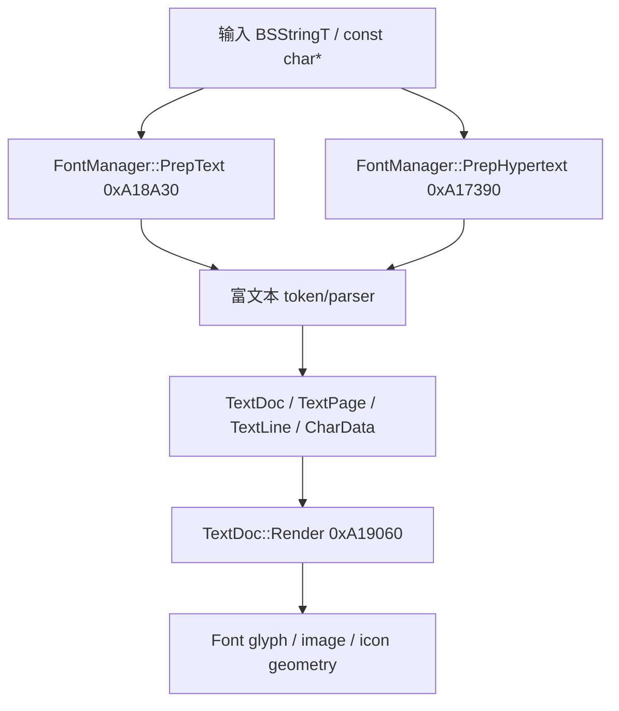
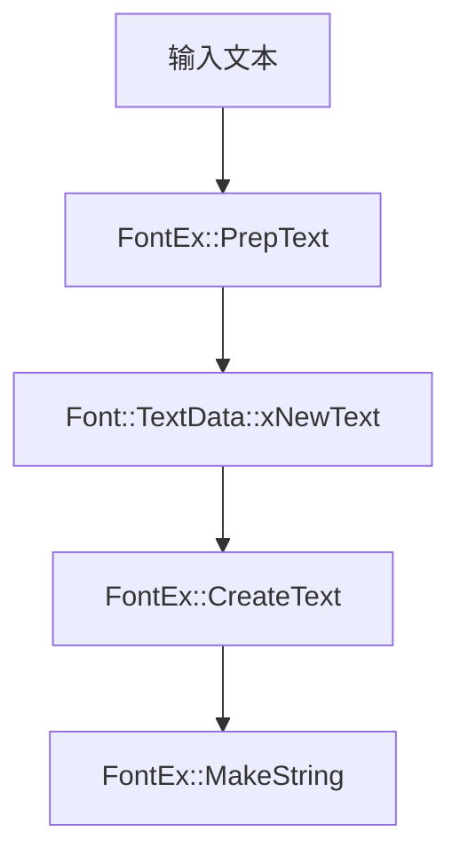

# 富文本多字节/UTF-8 Hook 设计文档

本文记录 Fallout: New Vegas 正式版与 Xbox 测试版逆向得到的富文本显示管线，并给出在 tNVSE 中为该管线补充多字节/UTF-8 文本支持的实现方案。目标是让普通文本路径与富文本路径都能使用同一套 CJK 字体扩展数据，避免 UTF-8 转换、自动换行、分页和最终渲染阶段拆开 DBCS 字节。

## 1. 范围与当前状态

tNVSE 当前已经覆盖了普通 `Font` 文本路径：

| 路径 | 正式版地址 | 当前 tNVSE 状态 |
| --- | ---: | --- |
| `Font::Font` / 初始化 | `0xA12020` | `WriteRelJumpEx(0xA12020, &FontEx::FontConstructor)` |
| `Font::Load` | `0xA15320` | `WriteRelJumpEx(0xA15320, &FontEx::Load)` |
| `Font::PrepText` | `0xA12FB0` | `WriteRelJumpEx(0xA12FB0, &FontEx::PrepText)` |
| Terminal `PrepTextForTerminal` call site | `0x759281` | `WriteRelCallEx(0x759281, &FontEx::PrepTextForTerminal)` |
| `Font::CreateText` | `0xA12880` | `WriteRelJumpEx(0xA12880, &FontEx::CreateText)` |
| `Font::MakeString` | `0xA12460` | `WriteRelJumpEx(0xA12460, &FontEx::MakeString)` |
| `FontManager::CalculateStringDimensions` | `0xA1B020` | `WriteRelJumpEx(0xA1B020, &FontManagerEx::CalculateStringDimensions)` |

富文本路径当前已经接入入口转换、DBCS 合并、渲染发射点和生命周期清理，但 parser/tokenizer 与部分 layout helper 仍主要复用原版：

| 路径 | 正式版地址 | 当前 tNVSE 状态 |
| --- | ---: | --- |
| `FontManager::PrepText` | `0xA18A30` | `WriteRelCallEx(0xA18F4A, &FontManagerEx::PrepText)` call site 重定向；内部包 UTF-8 转换后调原版 `0xA18A30` |
| `FontManager::PrepHypertext` | `0xA17390` | `WriteRelCallEx(0xA18ACC, &FontManagerEx::PrepHypertext)` call site 重定向；内部包 UTF-8 转换后调原版 `0xA17390` |
| `FontManager::CollectTo` | `0xA16EA0` | `PrepHypertext` 的 8 个 call site 已用 `WriteRelCall` 包装；普通可见文本段和 quoted/unquoted 属性值启用 DBCS-aware 路径，其余参数回原版 |
| `TextDoc::Render` | `0xA19060` | `WriteRelCallEx(0xA18F63, &FontManagerEx::TextDocRender)`；内部 `BeginRichTextRenderContext` + 原版 `0xA19060` + `EndRichTextRenderContext` |
| `TextDoc::Render` 字符发射点 | `0xA19622` | `WriteRelCallEx(0xA19622, &FontEx::TextDocRenderAddChar)`；DBCS 改用扩展 glyph |
| `TextDoc::~TextDoc` | `0xA1B990` | `WriteRelCallEx(0xA18F7D, &FontManagerEx::TextDocDestructor)`；清理 side table 后调原版析构 |
| `TextDoc::AddChar` | `0xA19A10` | `WriteRelCallEx` 4 处 call site 重定向；DBCS lead/trail 合并 + side table 登记；trail `CharData` 合并后释放 |
| `TextPage::AddChar` | `0xA19C00` | `WriteRelCallEx` 2 处 call site 重定向到 `FontManagerEx::TextPageAddChar`；DBCS 后置修正 `iLastFontHeight` |
| `TextLine::AddChar` | `0xA19F70` | `WriteRelCallEx(0xA19C80, &FontManagerEx::TextLineAddChar)`；Multibyte 模式保留既有 DBCS overflow 处理，FreeType-only 在原版行/页决策前写入最终字形宽度 |
| `CharData::Copy` | `0xA1B660` | `WriteRelCall` 4 处 call site 重定向到 `FontManagerEx::CharDataCopy`；复制时同步/清理 side table |

详见第 12 节"当前实现进度"。

## 2. 逆向依据

### 2.1 正式版函数

以下地址来自 PC 正式版 `FalloutNV.exe`：

| 函数 | 地址 | 作用 |
| --- | ---: | --- |
| `FontManager::PrepHypertext` | `0xA17390` | 富文本/超文本入口之一，解析带链接或文档语义的文本 |
| `FontManager::PrepText` | `0xA18A30` | 富文本普通入口，构造 `TextDoc`/页面/行/字符数据 |
| `TextDoc::Render` | `0xA19060` | 遍历 `TextDoc` 生成实际可见几何 |
| `FontManager::CalculateStringDimensions` | `0xA1B020` | 字符串尺寸计算，当前已有 DBCS 处理 |
| `FontManager::GetLinePadding` | `0xA1B3A0` | 取字体行距补偿，当前通过 `FontManager::GetLinePadding` 包装调用 |

富文本内部 helper：

| 函数 | 地址 | 作用 |
| --- | ---: | --- |
| `FontManager::GetCharType` | `0xA16DA0` | 富文本 tokenizer 对单字节分隔符分类 |
| `FontManager::CollectTo` | `0xA16EA0` | 从输入缓冲收集普通文本、tag 名、属性名、属性值 |
| `FontManager::TextDoc::CurrentPage` | `0xA18FF0` | 按 `TextDoc::iPageNum` 返回当前页 |
| `FontManager::TextDoc::AddChar` | `0xA19A10` | 把 `CharData` 加到当前 `TextPage`，必要时创建新页 |
| `FontManager::TextPage::GetCharCountForFont` | `0xA19B00` | 统计某页内指定字体的非图片字符数 |
| `FontManager::TextPage::AddChar` | `0xA19C00` | 把 `CharData` 加到当前行，处理分页高度 |
| `FontManager::TextLine::AddChar` | `0xA19F70` | 行宽、自动换行、尾部字符搬移和 hyphen 插入 |
| `FontManager::CharData::CharData` | `0xA1B450` | 初始化单个字符节点 |
| `FontManager::CharData::Copy` | `0xA1B660` | 复制 `CharData` 并分配 `0x38` 字节 |
| `FontManager::CharData::RevertToDefault` | `0xA1B770` | 恢复默认字体、颜色、对齐和空格字符 |
| `FontManager::CharData::SetChar` | `0xA1B7F0` | 写入 `cChar` 并按 `pFontLetters[cChar]` 刷新度量 |
| `FontManager::TextPage::TextPage` | `0xA1BC70` | 初始化 `TextPage` 并添加首字符 |

相关底层行为：

- `ConvertToAsciiQuotes 0xA122B0` 会将 Windows smart quotes 转为 ASCII quotes。富文本 parser 对 ASCII 字节调用它是合理的，但不能对 DBCS trail byte 单独调用。
- `AlignLineWidthToTab 0xEC9130` 等价于 `fmod(currentWidth, tabWidth)` 风格的 x87/CRT remainder。正式版 tab 行宽逻辑不是整数 `%`，富文本实现要维持相同行为。
- 富文本路径创建的 `TextDoc` 是独立文档模型，和普通 `Font::TextData` 的 `xLineWidths`/`xNewText` 管线不同。

### 2.2 测试版 PDB 命名与正式版结构

`ui_decode.h` 中的富文本结构字段名来自 2010-08-22 Xbox Release Beta PDB，offset 已按 PC 正式版校验。

`FontManager::TextData`，大小 `0x40`：

| Offset | 字段 | 说明 |
| ---: | --- | --- |
| `00` | `iDefaultFont` | 默认字体 |
| `04` | `iJustification` | `1=left`, `2=center`, `4=right` |
| `08` | `xColor` | 默认颜色 |
| `18` | `cLineSep` | 换行分隔符 |
| `1C` | `iWidth` | 页面/文本宽度 |
| `20` | `iHeight` | 页面/文本高度 |
| `24` | `iPageNum` | 当前页 |
| `28` | `iLines` | 行数限制/请求值 |
| `2C` | `iNumPages` | 输出页数 |
| `30` | `iNumLines` | 输出行数 |
| `34` | `bIsHypertext` | 是否超文本路径 |
| `38` | `xNewText` | 处理后的文本 |

`FontManager::CharData`，大小 `0x38`：

| Offset | 字段 | 说明 |
| ---: | --- | --- |
| `00` | `iFontIndex` | 字体索引，沿用原版语义 |
| `04` | `cChar` | 原版单字节字符 |
| `05` | `pad05[3]` | 原版 padding；tNVSE 不在这里保存私有状态 |
| `08` | `xColor` | 字符颜色 |
| `18` | `iJustification` | 对齐方式 |
| `1C` | `xFilename` | 非空时表示 `IMG`/`SRC` 图片项，不应按字符渲染 |
| `24` | `iWidth` | 字符或图片宽度 |
| `28` | `iRise` | baseline 上升 |
| `2C` | `iDrop` | baseline 下降 |
| `30` | `iLeadingEdge` | leading edge |
| `34` | `iX` | 行内 X 位置 |

`FontManager::TextLine`，大小 `0x30`：

| Offset | 字段 | 说明 |
| ---: | --- | --- |
| `00` | `xChars` | `CharData*` 列表 |
| `0C` | `iWidth` | 行宽 |
| `10` | `iNextSpacing` | 下一字符间距/尾随 spacing |
| `14` | `iRise` | 行最大 rise |
| `18` | `iDrop` | 行最大 drop |
| `1C` | `iSkippedSpace` | 换行时跳过的空格宽度 |
| `20` | `iJustify` | 行对齐 |
| `24` | `iPageWidth` | 页宽 |
| `28` | `unk28` | 未完全确认 |
| `2C` | `pPage` | 所属页 |

`FontManager::TextPage`，大小 `0x44`：

| Offset | 字段 | 说明 |
| ---: | --- | --- |
| `00` | `xLines` | `TextLine*` 列表 |
| `0C` | `iWidth` | 页面最宽行 |
| `10` | `iHeight` | 页面高度 |
| `14` | `iPageWidth` | 页宽 |
| `18` | `iPageHeight` | 页高 |
| `1C` | `iLastFontHeight` | 上次字体高度 |
| `20` | `pCharsPerFont[8]` | 每个字体的字符计数 |
| `40` | `pDoc` | 所属文档 |

`FontManager::TextDoc`，大小 `0x18`：

| Offset | 字段 | 说明 |
| ---: | --- | --- |
| `00` | `xPages` | `TextPage*` 列表 |
| `0C` | `iPageWidth` | 页宽 |
| `10` | `iPageHeight` | 页高 |
| `14` | `iPageNum` | 页号 |

### 2.3 IDA 反编译得到的管线行为

本节基于 IDA 9.3 对 PC 正式版 IDB 副本和 Xbox 测试版 PDB IDB 的导出结果，用来约束后续 hook 的实际落点。

#### 2.3.1 `FontManager::PrepText 0xA18A30`

正式版 `PrepText` 行为可以归纳为：

1. `BSStringT<char>::pString == nullptr` 时直接返回 `nullptr`。
2. `TextData::iWidth` 或 `iHeight` 小于 `2` 时改为 `0x7FFFFFFF`，表示近似无限宽/高。
3. 先调用 `FontManager::PrepHypertext 0xA17390`。如果返回非空 `TextDoc*`，`PrepText` 直接返回该文档。
4. 若不是 hypertext，则分配 `0x18` 字节的 `TextDoc`，写入 `iPageWidth/iPageHeight/iPageNum`。
5. 在栈上构造默认 `CharData`，再按 `TextData` 写入默认字体、颜色和 justification。
6. 循环主体是单字节：

```cpp
for (i = 0; i < textLen; ++i)
{
    acChar = text->pString[i];
    ConvertToAsciiQuotes(&acChar);

    if (acChar == data->cLineSep)
        ++aiNewLines;
    else if (acChar == '\t' || acChar >= 0x20)
    {
        CharData::SetChar(&current, acChar);
        CharData* copy = current.Copy();
        doc->AddChar(copy, aiNewLines, false);
        aiNewLines = 0;
    }
}
```

因此 `PrepText` 的正式版缺陷不是单独一个渲染点，而是输入 cursor、quote 转换、换行计数、`CharData::SetChar` 和 `TextDoc::AddChar` 都把一个 `char` 当成一个可见字符。DBCS lead/trail 在这里会被拆成两个 `CharData`。

函数结束时会重写 `TextData` 输出字段：

- `bIsHypertext = 0`
- `iNumPages = doc->xPages.m_kAllocator.m_uiCount`
- `iWidth/iHeight` 来自当前页行宽和行高累计
- `iNumLines` 来自当前页 `xLines` 计数

#### 2.3.2 `FontManager::PrepHypertext 0xA17390`

`PrepHypertext` 是一个更完整的富文本 parser。它先复制输入到临时缓冲，然后用 `CollectTo` 和 `GetCharType` 分段读取文本、tag、属性名和属性值。确认进入 hypertext 后同样分配 `0x18` 字节 `TextDoc`，并设置 `TextData::bIsHypertext = 1`。

关键行为：

- 普通文本段来自 `CollectTo` 结果，随后逐字节循环：

```cpp
for (i = 0; i < collectedTextLen; ++i)
{
    CharData::SetChar(&current, collectedText[i]);
    if (current.cChar == 1)
        current.iWidth = ButtonIcons[nextIcon].fWidth + ButtonIcons[nextIcon].fSpacing;
    doc->AddChar(current.Copy(), pendingNewLines, pendingNewPage);
}
```

- tag 和属性会被转为大写后比较，例如 `IMG`, `SRC`, `WIDTH`, `HEIGHT`, `DIV`, `FONT`, `FACE`, `COLOR`, `ALIGN`, `LEFT`, `CENTER`, `RIGHT`, `BR`, `P`, `HR`, `/FONT`。
- `IMG SRC` 会通过 `xFilename` 表示图片项，图片项后续不走 `pFontLetters[cChar]`。
- `WIDTH` 写 `CharData::iWidth`，`HEIGHT` 写 `iRise` 并把 `iDrop` 置 `0`。
- `FACE` 通过字体文件名或数字切换 `iFontIndex`。
- `COLOR` 解析 6 位十六进制 RGB 并写 `xColor`。
- `ALIGN` 改 `iJustification`，`BR/P/HR` 改 pending newline/new page 状态，`/FONT` 调 `CharData::RevertToDefault`。

这个函数的危险点比 `PrepText` 更多：不仅普通文本段按单字节循环，`CollectTo` 本身也按单字节识别 `<`, `>`, `{`, `}`, `=`, quote、空白和 `\0`。对当前支持的 DBCS codepage，并非所有这些字节都可能成为 trail byte；但 `{`、`}` 等合法 ASCII-range trail 仍会让 parser 在字节中间切开 token，因此普通文本段必须按 DBCS cursor 推进。

#### 2.3.3 `GetCharType 0xA16DA0` 与 `CollectTo 0xA16EA0`

`GetCharType(char)` 返回的是 bitmask：

| 字符 | 返回值 | 语义 |
| --- | ---: | --- |
| `'\0'` | `0x20` | 结束 |
| `'<'`, `'{'` | `0x01` | open delimiter |
| `'>'`, `'}'` | `0x02` | close delimiter |
| `'"'`, `'\''` | `0x08` | quote |
| `'='` | `0x10` | assignment |
| `<= 0x20` | `0x04` | 空白/控制字符 |
| 其他 `> 0x20` | `0x00` | 普通字符 |

`CollectTo` 每轮读取 `input[index]`，立刻调用 `GetCharType`。当启用实体替换时，它还会按单字节扫描 `&...;`，通过 `Interface::FindTextReplacementString` 替换 GameSetting 文本或调用 `Font::AddTextIcon` 生成 icon 字符 `1`。

对 DBCS/UTF-8 hook 来说，这意味着：

- 不能只在 `PrepHypertext` 的普通文本循环里处理 DBCS；`CollectTo` 级别也必须 DBCS-aware。
- tag 内部仍应保持 ASCII 语法，但普通文本段中遇到 DBCS lead 后，trail byte 不允许再参与 delimiter 判断。
- `&...;` 实体扫描必须只在 ASCII `&` 开始时启用；DBCS trail byte 为 `0x26` 时不能进入实体逻辑。

#### 2.3.4 `CharData` helper 的实际副作用

`CharData::CharData 0xA1B450`：

- 分配/初始化结构大小为 `0x38`。
- 写 `iFontIndex`、`cChar`、`xColor`、`iJustification`、`xFilename`。
- 用 `pFont[iFontIndex]->pFontData->pFontLetters[cChar]` 分字段读取 `fLeadingEdge/fWidth/fSpacing/fHeight/fTopEdge`，再写回 `iWidth/iRise/iDrop/iLeadingEdge/iX`。
- 不初始化 `pad05[3]`。

`CharData::SetChar 0xA1B7F0`：

- 写 `cChar = acChar`。
- 如果 `xFilename` 为空，则用 `pFontLetters[cChar]` 刷新 `iWidth/iRise/iDrop`。
- `iWidth` 不是只写 `fWidth`，也不是 `fWidth + fSpacing`：当 `fWidth > 0` 时写 `ConditionalFloatToUInt(fWidth + fLeadingEdge + fSpacing)`；否则写 `ConditionalFloatToUInt(fWidth)`。
- `iLeadingEdge` 写 `0`，`iX` 写 `0`。正式版在 `CharData` 层没有把 leading 单独保存在 `iLeadingEdge` 里，而是把它折进 `iWidth`。
- 不清理 `pad05[3]`。

`CharData::Copy 0xA1B660`：

- `MemoryManager::Allocate(0x38)`。
- 调 `CharData::CharData(newChar, this->iFontIndex, this->cChar, this->xColor, this->iJustification)`。
- 复制 `xFilename`、`iWidth`、`iRise`、`iDrop`、`iX`。
- 将 `iLeadingEdge` 置 `0`。
- 不复制 `pad05[3]`。

这点非常关键：`pad05[3]` 不是稳定的业务字段，原版 constructor、`SetChar` 和 `Copy` 都不保证它的内容。tNVSE 不应把 DBCS trail byte 或 flag 写进 `pad05`，否则会同时遇到两个问题：原版 `Copy` 丢失扩展状态，以及未初始化 padding 被误判为 tNVSE 标记。

富文本 DBCS 状态应使用外部 side table 保存，例如 `CharData* -> RichTextCharExtra`。DBCS 分支在得到最终 heap `CharData*` 后登记 side table；ASCII、图片、icon 路径不登记。若 `CharData` 经过 `Copy` 或 layout 迁移，wrapper 必须同步迁移 side table 关联，而不是修改原结构体 padding。

#### 2.3.5 `TextDoc`/`TextPage`/`TextLine` layout helper

`TextDoc::AddChar 0xA19A10`：

- 若文档没有页，或 `abNewPage != false`，分配 `0x44` 字节 `TextPage`。
- 否则调用当前尾页 `TextPage::AddChar(apChar, aiNewLines)`。
- 新页通过 `TextPage::TextPage 0xA1BC70` 初始化并加入 `xPages`。

`TextPage::AddChar 0xA19C00`：

- `aiNewLines > 1` 时把 `iLastFontHeight` 累加到 `iSkippedSpace`。
- 若当前页没有行或 `aiNewLines != 0`，分配 `0x30` 字节 `TextLine`。
- 否则调用尾行 `TextLine::AddChar`。
- 对非图片字符，用 `pFontLetters[cChar]` 更新 `iLastFontHeight`，再按 `iSkippedSpace + iRise + iHeight` 判断是否分页。
- 对非图片字符递增 `pCharsPerFont[iFontIndex]`。

`TextLine::AddChar 0xA19F70`：

- 优先用 `CharData::iWidth + line->iWidth <= line->iPageWidth` 判断能否加入当前行。
- 加入时直接使用 `CharData::iWidth/iRise/iDrop/iLeadingEdge/iX`，所以 DBCS 只要作为一个 `CharData` 进入，行宽计算可以复用原版大部分逻辑。
- 溢出且当前字符是 ASCII space (`cChar == 32`) 时，把该字符 `SetChar(0)` 后开新行。
- 溢出且行内存在 ASCII space 时，从行尾向前搬移 `CharData` 到新行，直到遇到 space，然后释放该 space。
- 溢出且行内没有 space 时，会分配一个 `'-'` 的 `CharData` 插入原行，再把尾部字符搬到新行。

因此只 hook `PrepText`/`PrepHypertext` 还不够严格：如果继续调用原版 `TextPage::AddChar`，DBCS 的 `iLastFontHeight` 仍会按 `pFontLetters[lead]` 计算；如果继续调用原版 `TextLine::AddChar`，CJK 无空格长行可能触发原版西文 hyphen 插入。可落地方案有两种：

1. 保留原版 `TextDoc::AddChar`/`TextPage::AddChar`/`TextLine::AddChar`，但 hook DBCS 分支涉及的 `TextPage::AddChar` 高度更新和 `TextLine::AddChar` 无空格换行策略。
2. 在 tNVSE 的富文本 parser 中直接构造 `TextDoc`/`TextPage`/`TextLine`，自行执行 DBCS-aware layout，只复用结构和渲染阶段。

#### 2.3.6 `TextDoc::Render 0xA19060`

正式版渲染阶段流程：

1. 根据 `TextDoc::iPageNum` 选择当前 `TextPage`。
2. 对 `fontIndex = 0..7` 调 `TextPage::GetCharCountForFont`，为每个有字符的字体调用 `Font::MakeTriShape 0xA14A20`。
3. 如果 `pFont[0]->ButtonIcons.uiSize` 非零，调用 `Font::MakeIconsTriShape 0xA14DA0`。
4. 遍历行，若 `TextData::bIsHypertext` 为真，则用 `TextDoc::iPageWidth` 参与 center/right 对齐。
5. 遍历 `CharData`：
   - `xFilename` 为空且 `cChar == 1`：调用 `Font::AddIcon 0xA14650`。
   - `xFilename` 为空且普通字符：调用 `Font::AddChar 0xA142D0`，参数里的 glyph 是 `&font->pFontData->pFontLetters[cChar]`。
   - `xFilename` 非空：调用 `FontManager::MakeImage 0xA1A800`。
6. 结束后计算 bounds、attach 到父 `NiNode`，并清空 `pFont[0]->ButtonIcons`。

DBCS 渲染 hook 的最小目标是第 5 步普通字符分支：当 `CharData` 带 tNVSE DBCS 标记时，不取 `pFontLetters[cChar]`，而是用 `extraGlyphs[(lead << 8) | trail]` 作为 `FontLetter*` 调 `Font::AddChar 0xA142D0`。

## 3. 富文本管线数据流

正式版富文本路径可以按以下阶段理解：



普通 `Font` 路径是：



两者最大差异是：普通路径在 `Font::TextData::xNewText` 内保存处理后的线性字符串；富文本路径则先构造 `TextDoc`，每个可见单元是一个 `CharData` 节点。因此只改 `FontEx::PrepText` 不会覆盖富文本文档。

## 4. 当前 tNVSE 编码与字体扩展机制

tNVSE 当前多字节机制由以下部分组成：

- `g_uiEncoding` 控制 UI 编码选项：`0=Windows-1252`, `1=GBK`, `2=Big5`, `3=SJIS`, `4=UHC/CP949`。
- `g_usingWinEncoding` 保存配置的 Windows codepage：`1252`, `936`, `950`, `932`, `949`；不再用 `0` 充当英文哨兵。
- `g_bEnableUTF8` 只在东亚 UI 模式（`uiEncoding=1-4`）将 UTF-8 输入转换为当前 codepage；`uiEncoding=0` 保持原始 Windows-1252 字节。
- `g_bEnableMultibyteFontHook` 只控制多字节解析能力。FreeType 有独立开关；FreeType-only 模式固定使用有效 code page 1252，并由 tNVSE 按逆向得到的原版空格、`~`、硬连字符、控制字符和行数规则自行准备普通文本。富文本在原版 tag 状态机产生 `CharData` 时、拓扑决定之前注入最终 FreeType 宽度。开关为 `1` 时保留既有 DBCS 路径。
- `ConvertToMultiByte` / `UTF8ToMultiByteStr` 负责 UTF-8 到 codepage 字节串转换。
- `TryDecodeDoubleByte` 根据当前 codepage 识别 DBCS 字符，并返回 `code = (lead << 8) | trail`。
- `gNumberedExtraLetters[fontID]` 保存扩展 `FontLetter` map；代码层通过 `font_glyphs.h` 的共享 helper 访问它，用于 CJK glyph 宽度、行高和渲染。

普通路径已实现的关键行为：

- 读入扩展字体：`FontEx::LoadExtraGlyphs` 从字体文件 dense 扩展区读取 `0x81..0xFE x 0x40..0xFE` 的 `FontLetter`。
- 宽度计算：`FontManagerEx::CalculateStringDimensions` 对 DBCS 调 `TryDecodeDoubleByte`，用 `extraGlyphs[code]` 计算宽度。
- 文本准备：`FontEx::PrepText` 处理 DBCS cursor、自动换行和 `xLineWidths`。
- 渲染：`FontEx::CreateText` / `MakeString` 遇到 DBCS 时调用正式版 glyph 构造辅助函数，使用扩展 `FontLetter`。

富文本实现应复用上述编码 helper 和 extra glyph map，不应重新定义另一套 DBCS 范围。

## 5. 需要补齐的富文本 Hook

### 5.1 Hook 入口

富文本 hook 与普通 `Font` 管线 hook 同样采用 call site 重定向 + `FontManagerEx` / `FontEx` 包装函数的成熟风格，签名以正式版调用约定为准（已落地实现见 `font_manager.h`）。多数 thiscall call site 使用 `WriteRelCallEx`；`CharData::Copy` 因原版 `ECX` 是 `CharData*`，使用 `WriteRelCall` 到静态 `__fastcall` wrapper：

```cpp
NiPoint3* __thiscall CalculateStringDimensions(NiPoint3* out, const char* src, UInt32 font, float wrap, UInt32 start);
static BSStringT<char>* __fastcall CollectTo(FontManager* apManager, void*, BSStringT<char>* apOutString,
                                             const char* apSource, UInt32* apIndex, UInt32 aiStopMask,
                                             UInt32 aiRequiredMask, UInt32* apOutType,
                                             char* apOutChar, bool abUseReplacements);
TextDoc* __thiscall PrepHypertext(BSStringT<char>& arTextString, TextData& arData);
TextDoc* __thiscall PrepText(BSStringT<char>& arTextString, TextData& arData);
void __thiscall TextDocRender(NiNode* apNode, TextData* apData);
void __thiscall TextDocDestructor();
void __thiscall TextDocAddChar(CharData* apChar, int aiNewLines, bool abNewPage);
TextPage* __thiscall TextPageAddChar(CharData* apChar, int aiNewLines);
static CharData* __fastcall CharDataCopy(CharData* apChar, void*);
```

设计阶段锁定的 hook 目标和当前状态：

| Hook | 地址 | 目的 | 当前状态 |
| --- | ---: | --- | --- |
| `FontManager::PrepText` | `0xA18A30` | 接管普通富文本构建 | 已通过 `0xA18F4A` call site wrapper 落地 |
| `FontManager::PrepHypertext` | `0xA17390` | 接管超文本构建，保留 link/hypertext 语义 | 已通过 `0xA18ACC` wrapper 做 UTF-8 转换；8 个 `CollectTo` call site 已包装，普通文本段和属性值启用自定义 DBCS cursor，仍复用原版 `PrepHypertext` 主体 |
| `TextDoc::Render` 或内部字符发射点 | `0xA19060` | 让 DBCS `CharData` 使用扩展 glyph 渲染 | 已 hook render 入口和 `0xA19622` 字符发射点 |
| `CharData::Copy` 或 DBCS copy wrapper | `0xA1B660` | 确保 `RichTextCharExtra` side table 关联不在复制时丢失 | 已 hook 4 个 call site |
| `TextPage::AddChar` DBCS 分支 | `0xA19C00` | 修正 `iLastFontHeight` 对 `pFontLetters[lead]` 的错误依赖 | 已通过 2 个 call site wrapper 后置修正 |
| `TextLine::AddChar` DBCS 分支 | `0xA19F70` | 避免 CJK 无空格换行触发原版 hyphen 插入 | 已 hook `0xA19C80` 外部 call site；DBCS 溢出时直接新建下一行 |
| `FontManager::CollectTo` | `PrepHypertext` 8 个 call site 调 `0xA16EA0` | 让普通文本段和属性值按 DBCS cursor 收集，不让 trail byte 参与 delimiter 判断 | 已用 `WriteRelCall` 到 `FontManagerEx::CollectTo` / `CollectToAttributeValue`；普通文本段与 `0xA17D5D` / `0xA17DE9` 属性值启用自定义路径，其余回原版 |

如果 `TextDoc::Render` 整体重写风险过高，优先选择其内部“从 `CharData` 发射 glyph”的 call site 做局部 hook。局部 hook 的目标是：ASCII 仍走原版，图片项仍走原版；只有能在 side table 中查到 DBCS code 的 `CharData` 改走扩展 glyph。

如果富文本 parser 未来选择完全自行 layout，并且不调用原版 `TextPage::AddChar`/`TextLine::AddChar`，`TextPage::AddChar` wrapper 可以退化为兼容保护，`TextLine::AddChar` 也可不再需要二进制 hook；但此时必须自己完整维护 `TextLine::iWidth/iRise/iDrop/iSkippedSpace`、`TextPage::iHeight/iLastFontHeight/pCharsPerFont[8]` 和分页。

### 5.2 输入转换策略

富文本入口必须在解析 tag 前完成 UTF-8 到目标 codepage 的转换，但不能破坏原有富文本语法。**应当直接复用普通 `Font` 管线已封装的 `ConvertToMultiByte` 单调用模式，保持两条管线行为一致，不应在富文本侧重新组合 `g_bEnableUTF8` / `g_uiEncoding` / `IsValidUTF8With3ByteMin` 条件链。**

`encoding.h` 中 `ConvertToMultiByte(const char*& pSrc, std::string& outConverted, bool hasExtraGlyphs)` 已经封装了第 4 节的 `ShouldConvertUTF8(hasExtraGlyphs)`（即 `g_bEnableUTF8 && IsEastAsianUiMode() && hasExtraGlyphs`）和 `IsValidUTF8With3ByteMin` 判断。富文本入口只需：

```cpp
const char* parserText = arTextString.pString ? arTextString.pString : "";
std::string convertedTextStorage;
if (ConvertToMultiByte(parserText, convertedTextStorage, HasRichTextExtraGlyphs()))
{
    BSStringT<char> convertedText;
    if (convertedText.Set(parserText))
    {
        // 用转换后的 BSStringT<char> 调原版 PrepText/PrepHypertext
        textDoc = FontManager::PrepText(convertedText, arData);
    }
}
else
{
    textDoc = FontManager::PrepText(arTextString, arData);
}
```

后续 parser 只处理转换后的 codepage 字节串。`HasRichTextExtraGlyphs()` 与 `Font` 管线的 `extraGlyphs != nullptr` 等价（任一字体的 `gNumberedExtraLetters` 非空即视为启用扩展）。

不要在 parser 中边解析边局部转换 UTF-8。UTF-8 是变长 1-4 字节，DBCS 是 1/2 字节；混用会使 tag offset、line break offset 和 hyperlink range 难以保持一致。

### 5.3 Parser 必须 DBCS-aware

富文本 parser 对普通文本区推进 cursor 时必须遵守：

```cpp
UInt32 code = 0;
if (extraGlyphs && TryDecodeDoubleByte(&text[i], code))
{
    EmitDbcsChar(text[i], text[i + 1], code);
    i += 2;
}
else
{
    EmitAsciiChar(text[i]);
    ++i;
}
```

以下逻辑不能只按单字节写：

- 查找 `<`, `>`, `{`, `}`, `=`, quote、空格、`\n`、`cLineSep` 等 delimiter。
- 自动换行时回退到上一字符边界。
- 计算 `iNumLines`、`iNumPages`、`TextLine::iWidth`。
- 统计 `TextPage::pCharsPerFont[8]`。
- 写入 `CharData::cChar`。

原因是 GBK/Big5/SJIS/CP949 的 trail byte 可能落在 ASCII 范围。例如 GBK/Big5/SJIS 的 `0x40..0x7E` 可以是 DBCS trail；parser 如果只扫描单字节 delimiter，会把 `{`、`}` 等合法 trail byte 误识别为 ASCII 语法符号。`<`、`>`、`=`、quote、`&`、`;`、space 对当前支持的 codepage 是负例，不应再作为必现风险样例。

### 5.4 DBCS 扩展状态的保存方式

不能改变正式版结构体大小，也不要把 tNVSE 状态写进正式版结构体 padding。推荐沿用普通 `FontEx` 旧管线的思路：游戏结构只保存原版能理解的数据，tNVSE 新增状态放在自己的外部结构中。

富文本路径新增 side table：

```cpp
struct RichTextCharExtra
{
    UInt32 dbcsCode; // (lead << 8) | trail
    const FontManager::TextDoc* textDoc;
};

std::unordered_map<const FontManager::CharData*, RichTextCharExtra> gRichTextCharExtras;
```

使用规则：

- `CharData::cChar` 仍只按原版语义保存一个字节。ASCII 时就是 ASCII 字符；DBCS 时可保存 lead byte，但完整 code 只从 side table 读取。
- DBCS 分支在生成最终 heap `CharData*` 后调用 `SetRichTextCharDbcs(ch, code, doc)`，同时记录所属 `TextDoc*`。
- ASCII、icon、image 路径不登记 side table；`xFilename` 非空的图片项永远走原版图片逻辑。
- `IsRichDbcsChar(ch)` 必须查询 side table，不能读取 `pad05`。
- 若调用原版 `CharData::Copy 0xA1B660`，copy wrapper 必须在拿到 new `CharData*` 后把 old `CharData*` 的 side table 记录和所属 `TextDoc*` 一起复制到 new `CharData*`。
- `TextDoc` 销毁、页面重建或 `CharData` 被释放时必须清理 side table，避免悬挂指针。销毁时既要遍历 `xPages -> xLines -> xChars`，也要按 `RichTextCharExtra::textDoc` 清理同一文档的离链副本。

示例 helper：

```cpp
void SetRichTextCharDbcs(const FontManager::CharData* ch, UInt32 code, const FontManager::TextDoc* doc = nullptr);
bool TryGetRichTextCharDbcs(const FontManager::CharData* ch, UInt32& code);
void ClearRichTextCharExtra(const FontManager::CharData* ch);
UInt32 ClearRichTextCharExtrasForDoc(FontManager::TextDoc* doc);
```

这比使用 `pad05` 更接近现有普通文字管线：普通 `FontEx::PrepText/CreateText/MakeString` 没有扩展游戏结构体，而是在 tNVSE 自己的 buffer、extra glyph map 和 helper 里维护多字节语义。富文本也应保持同样边界。

### 5.5 宽度、rise/drop 和分页

DBCS `CharData` 的度量应来自扩展 `FontLetter`：

```cpp
FontLetter* glyph = LookupDBGlyph(extraGlyphs, code);
iWidth = ConditionalFloatToUInt(
    glyph->fWidth +
    (glyph->fWidth > 0.0f ? glyph->fLeadingEdge + glyph->fSpacing : 0.0f));
rise = baseline;
drop = -font->fMaxDrop;
iLeadingEdge = 0;
```

这里刻意复刻正式版 `CharData::SetChar 0xA1B7F0` 的 `CharData` 写入口径：`FontLetter` 保留 `fLeadingEdge/fWidth/fSpacing` 分字段，但进入富文本 layout 后，`TextLine::AddChar 0xA19F70` 的溢出判断只读取 `CharData::iWidth`。因此 DBCS 合并后的 `CharData::iWidth` 必须承载原版逻辑 advance，`CharData::iLeadingEdge` 继续保持 0。

渲染阶段仍复用 `Font::AddChar 0xA142D0` 的分字段推进：先把 `position.x` 加 `fLeadingEdge`，用 `fWidth` 生成 quad，最后再加 `fWidth + fSpacing`（`fSpacing` 只在 `fWidth > 0` 时生效）。这与 `CharData::SetChar` 在正常正宽 glyph 上的总 advance 一致，同时避免在 `TextLine::AddChar` 和渲染阶段重复计算 leading。

分页和换行规则：

- DBCS 字符是不可拆分单元。
- 强制换行时，如果插入点落在 DBCS 的 lead/trail 中间，必须回退到 lead 前。
- `TextLine::iWidth` 统计应使用与正式版 `CharData::SetChar` 一致的 DBCS 宽度：`fWidth > 0 ? fWidth + fLeadingEdge + fSpacing : fWidth`。
- `TextPage::iWidth` 保持页面内最大行宽。
- `TextPage::iHeight` 和 `iLastFontHeight` 继续使用正式版行高规则与 `GetLinePadding`。

若沿用原版 `TextPage::AddChar 0xA19C00`，需要特别处理这段逻辑：它会用 `pFontLetters[cChar]` 计算 `iLastFontHeight`。DBCS 的 `cChar` 只保存 lead byte，不能拿来索引 256 项基础 glyph 表。DBCS 分支必须改成用扩展 `FontLetter` 计算 `iLastFontHeight = baseline + (glyph->fHeight - glyph->fTopEdge)`，或在自实现 layout 中维护等价字段。

若沿用原版 `TextLine::AddChar 0xA19F70`，还要注意原版长行无空格时会插入 `'-'`。这对西文是 hyphenation，对 CJK 富文本通常不是期望行为。DBCS-aware layout 应在“当前字符是 DBCS 且行内无 ASCII space”的情况下直接在字符边界换行，而不是插入 hyphen。

### 5.6 渲染阶段

渲染阶段需要区分三类 `CharData`：

1. `xFilename` 非空：图片或图标，完全走原版逻辑。
2. `IsRichDbcsChar(ch)`：使用 `GetRichDbcsCode(ch)`，把零基 `CharData::iFontIndex` 转成零保留的原版字体 ID，并经统一 `ResolveGameFont` 解析实际 `Font::iFontNum`，随后调用 `GetExtraGlyphs(fontNum)` / `LookupDBGlyph(extraGlyphs, code)`，再走扩展 glyph 渲染。这里仍只允许原版八个 rich-text shape/count 槽；JIP 的扩展注册表不是这个结构数组。
3. 其他：ASCII，完全走原版逻辑。

扩展 glyph 渲染应复用普通路径已经使用的正式版 helper：

- `0xA142D0`：当前 `FontEx::CreateText` / `MakeString` 已用于把 `FontLetter` 写入顶点。
- `Font::MakeTriShape 0xA14A20` 与图标路径仍沿用正式版对象创建方式。

正式版 `TextDoc::Render` 在 `0xA19604..0xA19622` 一带读取 `apCurrentChar->cChar`，计算 `cChar * sizeof(FontLetter)`，再把 `&pFontLetters[cChar]` 传给 `Font::AddChar 0xA142D0`。这是最适合局部 hook 的字符发射点：DBCS 分支只替换 `FontLetter*`，保留 `aiVert`、`NiTriShape*`、`NiPoint3` 和 `NiColorA` 参数。

`TextPage::GetCharCountForFont 0xA19B00` 只统计 `xFilename` 为空且 `iFontIndex` 匹配的 `CharData`，不关心 `cChar` 值，也不检查 `iWidth`。因此 DBCS 必须保持“一个可见 glyph 一个 `CharData`”。当前实现已移除早期的零宽 space 断点方案，DBCS trail `CharData` 合并后释放，不再额外进入 `TextDoc` / render 序列。

如果 hook `TextDoc::Render` 整体实现，必须完整复刻原版的：

- 页面选择 `TextDoc::iPageNum`。
- 行对齐：left/center/right。
- 图片 `xFilename` 渲染。
- 每字体分批生成 geometry 的逻辑。
- `pCharsPerFont[8]` 统计。

若只 hook 字符发射点，则只需要在发射 glyph 前替换 `FontLetter*` 和字符推进逻辑，风险更低。

## 6. 推荐实现顺序

### 阶段 1：只支持富文本 DBCS 度量，不改渲染

目标是验证 parser 能正确识别 DBCS，不拆字，并且 `TextDoc` 行/页结构稳定。

工作：

- 新增富文本 parser helper：`TryReadRichChar`、`GetRichCharWidth`、`InitRichCharData`。
- Hook `0xA18A30`，先只处理普通富文本，不处理 hypertext 特有交互。
- 对 DBCS `CharData*` 登记 `RichTextCharExtra` side table；若使用原版 `CharData::Copy`，必须在 copy wrapper 中复制 side table 关联。
- 沿用原版 `TextDoc::AddChar` / `TextPage::AddChar`，但通过 `FontManagerEx::TextPageAddChar` call-site wrapper 修正 DBCS `iLastFontHeight`。

验收：

- 文本不崩溃。
- `TextLine::iWidth` 与普通路径 `CalculateStringDimensions` 对同样字符串接近。
- DBCS 不被换行拆开。

### 阶段 2：局部 hook 渲染字符发射点

目标是让 side table 标记为 DBCS 的 `CharData` 显示为扩展 glyph。

工作：

- 在 `TextDoc::Render 0xA19060` 内定位 ASCII glyph lookup / vertex emission call site。
- 对 `IsRichDbcsChar` 分支改用 `extraGlyphs[code]`。
- 保持图片、ASCII、颜色、对齐、分页逻辑原样。
- 已同步修正 `TextPage::AddChar 0xA19C00` 的 DBCS `iLastFontHeight`，避免空行/分页高度继续按 lead byte 基础 glyph 计算。

验收：

- 普通富文本 CJK 可见。
- ASCII 与图片不回归。
- 自动换行处不丢字。

### 阶段 3：覆盖 `PrepHypertext`

目标是让超链接/帮助页面/富文本交互文档支持 CJK。

工作：

- Hook `0xA17390`。
- 替换或包装 `CollectTo 0xA16EA0` / `GetCharType 0xA16DA0` 的普通文本收集逻辑，使 DBCS trail byte 不参与 delimiter 判断。
- 复用阶段 1 parser helper 和阶段 2 的 DBCS copy/render 规则。
- 保留原版 hyperlink range、点击区域和页面数据。
- 若保留原版 `TextLine::AddChar`，为 DBCS 无空格长行增加不插 hyphen 的换行策略；若自实现 layout，则在自实现中处理。

验收：

- 链接文本中 CJK 可见且点击区域与可见文本对齐。
- tag 内 ASCII 语法不被 DBCS trail byte 干扰。

### 阶段 4：整理共享代码

目标是避免普通路径和富文本路径各自维护一套编码逻辑。

工作：

- 把 `LookupDBGlyph`、`TryGetDoubleByteAt`、宽度计算等 helper 提到共享头/源文件。
- 普通 `FontEx` 和富文本 `FontManagerEx` 都调用同一套 helper。
- 保留现有 `encoding.cpp` 中 codepage 规则作为唯一来源。

## 7. 关键边界条件

### 7.1 富文本 tag 与 DBCS

parser 必须只在“非 DBCS 字符”时把以下字节当作语法：

- `<`, `>`
- `/`
- `=`
- `"`
- `&`, `;`
- `\n`, `\r`
- `cLineSep`

如果当前字节和下一个字节能组成 DBCS，则两个字节必须作为文本字符整体消费。

### 7.2 UTF-8 转换时机

必须在 tag parser 前统一转换。否则 UTF-8 多字节序列可能包含 ASCII 范围字节，导致 parser 误判 tag 边界。

转换后 parser 面对的是当前 Windows codepage：

| `g_uiEncoding` | `g_usingWinEncoding` | 说明 |
| ---: | ---: | --- |
| `0` | `1252` | Windows-1252；不执行本节 UTF-8 转换或 DBCS 合并 |
| `1` | `936` | GBK |
| `2` | `950` | Big5 |
| `3` | `932` | Shift-JIS / CP932 |
| `4` | `949` | Korean / UHC |

### 7.3 字体缺字

如果 `TryDecodeDoubleByte` 成功但 `extraGlyphs` 中没有对应 code：

- 不应拆成两个 ASCII 字符。
- 推荐写入一个宽度为 0 或 fallback glyph 的 DBCS `CharData`，并打印一次性 debug log。
- 不应访问 `pFontLetters[lead]` 和 `pFontLetters[trail]` 伪造宽度，因为这会造成换行和渲染不一致。

### 7.4 Side Table 生命周期

tNVSE 富文本 hook 不读写 `pad05`，所有扩展状态都在 side table 中。生命周期规则：

- side table 的 key 是最终进入 `TextDoc` 的 heap `CharData*`。
- DBCS `CharData` 被复制、移动或重建时，必须同步迁移 `CharData* -> RichTextCharExtra` 记录。
- ASCII、图片、icon 项不登记 side table，渲染时查不到记录就按原版路径处理。
- `TextDoc` 销毁、页面重建或 `CharData` 释放时清理对应记录；调试阶段可以在 `TextDoc::Destroy 0xA1B990` wrapper 中粗粒度清空，正式实现应尽量按文档实例清理。
- side table 只保存 tNVSE 需要的扩展语义，不反向修改游戏原结构体字段。

## 8. 测试矩阵

### 8.1 编码覆盖

每种编码至少测试：

| 编码 | 必测样例 |
| --- | --- |
| GBK / 936 | 中文、trail byte 在 `0x40..0x7E` 的字符、长行换行 |
| Big5 / 950 | 繁体中文、标点、长行换行 |
| SJIS / 932 | 日文假名/汉字、CP932 lead `0xEB/0xEC/0xEF..0xFC`、半角假名单字节 |
| CP949 / 949 | 韩文、trail byte 在 ASCII 范围的字符、`0x60` 兼容槽位 |

### 8.2 富文本功能

构造以下文档：

- 纯 CJK 富文本。
- ASCII + CJK 混排。
- CJK 紧贴 tag：`<font>中文</font>`。
- CJK 内含自动换行边界。
- CJK 无空格长行，确认不会意外插入原版西文 hyphen，或行为符合设计。
- 多页文本。
- 多页 + 空行，确认 DBCS `iLastFontHeight` 不再按 lead byte 基础 glyph 计算。
- 不同颜色、不同字体、不同 justification。
- `` 或等价图片 tag。
- hypertext link 包含 CJK 文本。
- DBCS trail byte 命中当前支持编码中可能出现的 ASCII 范围符号，重点验证 GBK/Big5/SJIS 的 `{`、`}`、`|`、`~`、`@`、`[`、`]`、`` ` `` 等；`<`、`>`、`=`、quote、`&`、`;`、space 在 GBK/Big5/SJIS/CP949 中不是合法 trail byte，可作为负例/控制样例。
- DBCS `CharData` 经过 copy 后再渲染，确认 side table 关联没有被 `CharData::Copy` 丢失。

### 8.3 回归路径

不能回归现有路径：

- Terminal 文本。
- Quest 文本。
- Location 文本。
- HUD 普通字符串。
- 字典翻译前后文本。
- `FontManager::CalculateStringDimensions` 与普通 `FontEx::PrepText`。

### 8.4 验证标准

- 没有半个 DBCS 字符被写入 `CharData`。
- 自动换行处不丢字、不显示乱码。
- `TextLine::iWidth` 与可见文本宽度一致。
- 页数、行数和超链接区域与可见文本对齐。
- 图片项不被当作字符渲染。
- DBCS 字符的三角形预分配数量与实际 `Font::AddChar` 发射次数一致。
- ASCII、icon、image 项没有 side table 记录，不产生 DBCS 误判。
- ASCII 富文本与原版表现一致。

## 9. 实现注意事项

- 优先局部 hook `TextDoc::Render` 的 glyph 发射点，避免重写完整 renderer。
- 富文本 parser 若必须重写，先覆盖 `PrepText 0xA18A30`，再扩展到 `PrepHypertext 0xA17390`。
- 所有 native call 移除或替换时，按项目约定保留注释，不直接删除历史地址说明。
- 不要扩大 `FontManager`/`CharData` 等游戏结构体，也不要把新增状态写入 padding；所有新增状态必须放在 tNVSE 外部 side table 或自有 helper 结构。
- 不要把 UTF-8 字节直接写入 `CharData`；`CharData` 只保存 codepage 字节。
- 不要用 `IsLeadByte(lastByte)` 判断换行边界；必须用 `TryDecodeDoubleByte` 成对验证。

## 10. 最终目标

完成后，富文本路径应满足：

```text
UTF-8 输入
  -> 按配置转换为 GBK/Big5/SJIS/CP949 字节串
  -> 富文本 tag parser 保持语法正确
  -> DBCS 字符作为不可拆分单元进入 TextDoc
  -> TextLine/TextPage 使用扩展 glyph 计算宽度和分页
  -> TextDoc::Render 使用扩展 FontLetter 生成可见 CJK glyph
```

这样普通 `Font` 管线与富文本 `FontManager/TextDoc` 管线会共享同一套编码、字体扩展和 UTF-8 转换策略，避免当前富文本路径按单字节处理导致的丢字、乱码和换行错误。

## 11. IDA xref 复查结论与 Hook 清单

本节基于进一步 IDA 导出，目的是确认是否还有漏掉的富文本入口和必须 hook 的内部点。

### 11.1 调用关系结论

正式版富文本公开入口很集中：

```text
TileText::MakeNode 0xA21AF0
  call FontManager::CreateText 0xA18F00 at 0xA220C6
    call BSStringT<char>::SetFromInt at 0xA18F36
    call FontManager::PrepText 0xA18A30 at 0xA18F4A
      call FontManager::PrepHypertext 0xA17390 at 0xA18ACC
    call FontManager::TextDoc::Render 0xA19060 at 0xA18F63
    call FontManager::TextDoc::~TextDoc 0xA1B990 at 0xA18F7D
```

补充 xref 结论：

- `FontManager::CreateText 0xA18F00` 只有 `TileText::MakeNode 0xA21AF0` 一个富文本上层调用者。
- `FontManager::PrepHypertext 0xA17390` 只有 `FontManager::PrepText 0xA18A30` 一个调用者。
- `FontManager::CollectTo 0xA16EA0` 只被 `PrepHypertext` 调用，合计 8 个 call site。
- `FontManager::GetCharType 0xA16DA0` 被 `CollectTo` 调 3 次，被 `PrepHypertext` 直接调 1 次。
- `FontManager::CharData::Copy 0xA1B660` 只被 `PrepText` / `PrepHypertext` 调用，合计 4 个 call site。
- `FontManager::TextDoc::AddChar 0xA19A10` 只被 `PrepText` / `PrepHypertext` 调用，合计 4 个 call site。
- `TextPage::AddChar 0xA19C00` 只被 `TextDoc::AddChar` 和 `TextPage::TextPage` 调用。
- `TextLine::AddChar 0xA19F70` 被 `TextPage::AddChar`、`TextLine::TextLine` 和自身搬移逻辑调用。
- `Font::AddChar 0xA142D0` 同时被普通 `Font` 路径和 `TextDoc::Render` 调用，不能全局 hook；必须只 hook 富文本 render 内的 call site。

### 11.2 推荐实际添加的 Hook

按当前 tNVSE 代码状态，`game_hooks.cpp` 没有直接替换 `0xA18A30` 函数体，而是在正式版调用点安装 wrapper：`0xA18F4A` 调到 `FontManagerEx::PrepText`，`0xA18ACC` 调到 `FontManagerEx::PrepHypertext`。命名沿用现有 `FontEx::FontConstructor` / `FontEx::PrepText` 风格：扩展语义放在类名 `FontManagerEx` / `FontEx`，成员函数名保持原函数语义，地址只保留在安装点注释和文档表格中。

| 优先级 | Hook 点 | 地址 / call site | 当前/推荐方式 | 必要性 |
| --- | --- | ---: | --- | --- |
| 必须 | `FontManager::PrepText` | `0xA18F4A` call site 调 `0xA18A30` | 当前 `WriteRelCallEx` 到 `FontManagerEx::PrepText`，内部做 UTF-8 转换后调原版 | 富文本普通入口；负责 UTF-8 转 codepage、DBCS 合并进入 `TextDoc` |
| 必须 | `TextDoc::Render` 字符发射点 | `0xA18F63` / `0xA19622` | 当前 render 入口 wrapper + `FontEx::TextDocRenderAddChar` 局部 hook | 原版固定取 `pFontLetters[cChar]`；DBCS 必须改取 extra glyph |
| 必须 | `TextPage::AddChar` | `0xA19A6F` / `0xA1BD1C` call site 调 `0xA19C00` | 当前 `WriteRelCallEx` 到 `FontManagerEx::TextPageAddChar`，调原版后修正 DBCS `iLastFontHeight` | 修正 `iLastFontHeight` 不能按 lead byte 基础 glyph 计算 |
| 必须 | `TextLine::AddChar` | `0xA19C80` call site 调 `0xA19F70` | 当前 `WriteRelCallEx` 到 `FontManagerEx::TextLineAddChar`；Multibyte 模式维持既有 DBCS overflow 分支；FreeType-only 先写入最终字形宽度再进入原版行/页决策 | CJK 无空格长行不能触发原版 `'-'` hyphen；FreeType-only 的拓扑不能继续使用近似 `.fnt` 宽度 |
| 必须 | `CharData::Copy` 或 rich copy wrapper | `0xA17898` / `0xA179CD` / `0xA17FB6` / `0xA18D73` call site 调 `0xA1B660` | 当前 `WriteRelCall` 到 `FontManagerEx::CharDataCopy` | 原版只复制游戏字段；DBCS 的 side table 关联必须由 tNVSE 同步复制 |
| 必须 | `FontManager::CollectTo` | `PrepHypertext` 8 个 call site 调 `0xA16EA0` | 当前 6 处 `WriteRelCall` 到 `FontManagerEx::CollectTo`，`0xA17D5D` / `0xA17DE9` 到 `FontManagerEx::CollectToAttributeValue`；普通可见文本段和属性值启用自定义路径，其余参数回原版 | 原版按单字节分类，会让 DBCS trail byte 参与 delimiter 判断 |
| 非当前计划 | `FontManager::PrepHypertext` 完整 tokenizer | `0xA18ACC` call site 调 `0xA17390` | 当前入口 wrapper + `CollectTo` 普通文本段/属性值 DBCS-aware；原版主体仍负责 tag/属性名状态机，`0xA17DB9` direct `GetCharType` 仍保留 | GBK native 与 UTF-8 回归已通过，当前没有必要自建完整 parser；仅在出现稳定失败样本时重新评估 |

推荐不要把 `Font::AddChar 0xA142D0` 做全局替换。普通 `Font` 路径已经有 `FontEx::CreateText` / `MakeString`，全局 hook 会影响现有稳定路径。富文本只需要处理 `TextDoc::Render` 内 `0xA19622` 这一个 call site。

### 11.3 条件 Hook / 替代方案

以下不是首选必须 hook，但在不同实现策略下可能需要。

| 条件 | Hook 点 | 地址 | 说明 |
| --- | --- | ---: | --- |
| 如果不重写 `PrepHypertext`，而想复用原版 parser | `FontManager::CollectTo` | `0xA16EA0` / 8 个 call site | 当前已接管全部 `CollectTo` call site；wrapper 按原版 `stopMask` / `requiredMask` / `bKeep` 语义工作，tag 内 ASCII 语法仍由原版状态机决定 |
| 如果复用 `CollectTo` 但只改字符分类 | `FontManager::GetCharType` | `0xA16DA0` | 不推荐单独 hook，因为它只有 `char` 参数，没有 lead/trail 上下文 |
| 如果使用 side table 保存 DBCS 状态 | `TextDoc::~TextDoc` / `TextLine`/`TextPage` 析构 | `0xA1B990` 等 | 用于清理 `CharData* -> RichTextCharExtra` 映射 |
| 如果希望在最外层统一转换输入 | `FontManager::CreateText` | `0xA18F00` | 可作为 wrapper，但不是必须；`PrepText` 已能接收 `BSStringT<char>*` 并转换 |
| 如果要确认所有 tile 文本入口 | `TileText::MakeNode` | `0xA21AF0` / call `0xA220C6` | 只用于入口调查；不建议作为编码 hook 点 |

### 11.4 最小可落地组合

最小可落地组合是：

```text
1. Hook FontManager::PrepText 入口并统一 UTF-8 转 codepage
2. Hook FontManager::PrepHypertext 入口，并接管 8 个 DBCS-aware `CollectTo` call site
3. 使用 rich copy wrapper，或 hook CharData::Copy 0xA1B660，同步 side table 关联
4. Hook TextPage::AddChar 0xA19C00 的 DBCS 高度更新
5. 处理 TextLine::AddChar 0xA19F70 的 DBCS overflow 换行
6. Hook TextDoc::Render 的 0xA19604..0xA19622 glyph 发射点
```

当前第 1、3、4、5、6 项已通过 call site wrapper 或局部 hook 落地；第 2 项完成入口 wrapper、普通可见文本段 `CollectTo` DBCS-aware 路径，并把 `0xA17D5D` / `0xA17DE9` 属性值 call site 切到 `CollectToAttributeValue`。2026-07-04 的最新 DLL 测试证明，把 tag/属性名/空白扫描也改走自定义路径会让 `PrepHypertext` 卡死，因此这些参数组合仍回原版 `0xA16EA0`。`0xA17DB9` direct `GetCharType` 仍由原版执行。当前 GBK native 与中文 UTF-8 → GBK/CP936 回归已覆盖实际风险路径，**完整自建 `PrepHypertext` parser 不再列入当前计划**；只有出现局部 hook 无法解决的稳定失败样本时才重新评估。

## 12. 当前实现进度（2026-07-04 更新）

本节记录相对第 11 节"最小可落地组合"的实际落地情况。代码位于 `tnvse/Src/font/font_manager.cpp` / `font/font_engine.cpp` / `game/game_hooks.cpp`。整体策略已从"完全自建 layout"转向**复用原版 layout + side table + 局部 hook**，其中 `TextPage::AddChar` 已通过 call site wrapper 修正 DBCS 行高，`TextLine::AddChar` 已通过外部 call site wrapper 处理 DBCS overflow。

### 12.1 已安装的 Hook

`game_hooks.cpp::InitFontHooks` 按 `[Multibyte] bEnableMultibyteFontHook` 与
`[FreeTypeFont] bEnableFreeTypeFontRendering` 分别安装能力。两者都关闭时
不写入字体 patch；FreeType-only 时安装经过签名验证的核心入口、
自定义普通文本准备/测量桥、Render/AddChar 共享桥，以及只属于该模式的
`TextLine` 首字符精确宽度 call site。原版 `PrepHypertext` tag 状态机、
`CollectTo`、DBCS 合并和 extra-glyph hook 均保持未修改。多字节能力开启
时才安装下表中的 DBCS parser/layout patch：

| 地址 | Hook 目标 | 安装方式 | tNVSE 实现 |
| --- | --- | --- | --- |
| `0xA18F4A` | `FontManager::CreateText → PrepText` | `WriteRelCallEx` | `FontManagerEx::PrepText` |
| `0xA18ACC` | `PrepText → PrepHypertext` | `WriteRelCallEx` | `FontManagerEx::PrepHypertext` |
| `0xA18F63` | `CreateText → TextDoc::Render` | `WriteRelCallEx` | `FontManagerEx::TextDocRender` |
| `0xA19622` | `Render → Font::AddChar` (字符发射点) | `WriteRelCallEx` | `FontEx::TextDocRenderAddChar` |
| `0xA18F7D` | `CreateText → TextDoc::~TextDoc` | `WriteRelCallEx` | `FontManagerEx::TextDocDestructor` |
| `0xA178A4` / `0xA179D9` / `0xA17FC2` | `PrepHypertext → TextDoc::AddChar` | `WriteRelCallEx` | `FontManagerEx::TextDocAddChar` |
| `0xA18D7C` | `PrepText → TextDoc::AddChar` | `WriteRelCallEx` | `FontManagerEx::TextDocAddChar` |
| `0xA19A6F` | `TextDoc::AddChar → TextPage::AddChar` | `WriteRelCallEx` | `FontManagerEx::TextPageAddChar` |
| `0xA1BD1C` | `TextPage::TextPage → TextPage::AddChar` | `WriteRelCallEx` | `FontManagerEx::TextPageAddChar` |
| `0xA19C80` | `TextPage::AddChar → TextLine::AddChar` | `WriteRelCallEx` | `FontManagerEx::TextLineAddChar`；DBCS 模式沿用既有 overflow 处理，FreeType-only 在拓扑决定前写入精确宽度 |
| `0xA1BDE2` | `TextLine::TextLine → TextLine::AddChar` | `WriteRelCallEx`，仅 FreeType-only | 让每条新行的首字符也在分页/高度累计前取得最终 FreeType 宽度；Multibyte 模式不安装 |
| `0xA17898` / `0xA179CD` / `0xA17FB6` | `PrepHypertext → CharData::Copy` | `WriteRelCall` | `FontManagerEx::CharDataCopy` |
| `0xA18D73` | `PrepText → CharData::Copy` | `WriteRelCall` | `FontManagerEx::CharDataCopy` |
| `0xA1B020` | `FontManager::CalculateStringDimensions` | `WriteRelJumpEx` | `FontManagerEx::CalculateStringDimensions` |
| `0xA1772D` / `0xA17835` / `0xA17A1E` / `0xA17B65` / `0xA17BB1` / `0xA17CFE` | `PrepHypertext → CollectTo` | `WriteRelCall` | `FontManagerEx::CollectTo` |
| `0xA17D5D` / `0xA17DE9` | `PrepHypertext 属性值 → CollectTo` | `WriteRelCall` | `FontManagerEx::CollectToAttributeValue` |

注意：上述富文本入口大多是 `WriteRelCallEx`（call site 重定向），不是 `WriteRelJumpEx`（函数整体替换）。这意味着函数本身的 prolog 仍是原版代码，tNVSE 只在指定 call site 切入。`CharData::Copy` 例外使用 `WriteRelCall` 到 `static __fastcall FontManagerEx::CharDataCopy(CharData*, void*)`，因为原版 call site 的 `ECX` 是 `CharData*`，不能伪装成 `FontManagerEx*` 成员函数。`CollectTo` 例外使用 `WriteRelCall` 到 `static __fastcall FontManagerEx::CollectTo(FontManager*, void*, ...)`：正式版 `CollectTo 0xA16EA0` 的栈参数是隐藏返回对象指针 + 7 个逻辑参数，函数尾部 `retn 20h`，但入口仍通过 `ECX` 携带 `FontManager*`。当前 8 个 `CollectTo` call site 共用同一实现 helper：普通可见文本段和 `0xA17D5D` / `0xA17DE9` 属性值启用自定义 DBCS cursor，其余参数组合回原版。`Font::AddChar 0xA142D0` 未做全局替换，符合第 11.2 节"推荐不要全局 hook"的结论。

### 12.2 已实现的 DBCS 机制

#### Side Table（`RichTextCharExtra`）

按第 5.4 节设计落地，**未修改 `CharData::pad05`**：

```cpp
struct RichTextCharExtra
{
    UInt32 dbcsCode;
    const FontManager::TextDoc* textDoc;
};
std::unordered_map<const FontManager::CharData*, RichTextCharExtra> sRichTextCharExtras;
```

对外 API：`SetRichTextCharDbcs` / `TryGetRichTextCharDbcs` / `ClearRichTextCharExtra` / `ClearRichTextCharExtrasForDoc`。

生命周期管理：
- `TextDocDestructor`（hook `0xA18F7D`）通过 `ClearRichTextCharExtrasForDoc(doc)` 遍历 `xPages → xLines → xChars` 清理页面链表内字符，同时按 `RichTextCharExtra::textDoc == doc` 清理同一文档的离链副本，之后调用原版析构。
- `TextDocAddChar` 在 DBCS lead 字符到达但 trail 尚未到达时，用 `sPendingRichTextLeads[doc]` 暂存；trail 到达后合并为单个 DBCS `CharData` 再走原版 `TextDoc::AddChar`。文档销毁前 `DiscardPendingRichTextLead` 释放未匹配的 lead。

#### CharData::Copy side table 同步

已用 IDA 9.3 `idalib` 核对正式版 `0xA1B660`：

- `CharData::Copy` 分配 `0x38` 字节，调用 `CharData::CharData` 构造，并复制 `iWidth/iRise/iDrop/iX`，但不会复制 tNVSE 的 side table。
- 正式版对 `0xA1B660` 的 xref 为 4 个：`0xA17898`、`0xA179CD`、`0xA17FB6`（`PrepHypertext`）和 `0xA18D73`（`PrepText`）。
- 当前 `game_hooks.cpp` 已把这 4 个 call site 重定向到 `FontManagerEx::CharDataCopy`。地址只保留在安装点注释与本表格中，不进入函数名。`CharDataCopy` 是 `static __fastcall` wrapper，保留原版 call site 的 `ECX=CharData*`，先调用原版 `0xA1B660`，若源 `CharData*` 有 DBCS 记录则把 `dbcsCode` 和所属 `TextDoc*` 复制到新 `CharData*`；若源没有 DBCS 记录，则清理新地址可能残留的旧 side table 记录。
- 该实现不读写 `pad05`，不改变 `CharData` 大小，也不依赖调用点栈布局。

#### CollectTo 全 call site 接管

`CollectTo 0xA16EA0` 不能按普通 `thiscall` 或返回值对象去 hook。IDA 9.3 `idalib` 反编译和汇编显示它的第一个栈参数是输出 `BSStringT<char>*`，函数最后 `retn 20h`；同时入口保存 `ECX` 作为 `FontManager*`，后续 `GetCharType` / `Font::AddTextIcon` 路径会用到这个对象。因此当前实现使用 `WriteRelCall` 到 `static __fastcall FontManagerEx::CollectTo(FontManager*, void*, ...)`，正常接收 `ECX`，并保留原 8 个栈参数。

`PrepHypertext` 中 8 个 call site 现在全部接入该 wrapper：

```text
0xA1772D initial whitespace/open scan      stopMask=0x00 requiredMask=0x04 bKeep=0
0xA17835 visible text segment              stopMask=0x01 requiredMask=0x00 bKeep=1
0xA17A1E tag name / close delimiter        stopMask=0x06 requiredMask=0x00 bKeep=1
0xA17B65 attribute whitespace              stopMask=0x00 requiredMask=0x04 bKeep=0
0xA17BB1 attribute name                    stopMask=0x16 requiredMask=0x00 bKeep=1
0xA17CFE whitespace before attribute value stopMask=0x00 requiredMask=0x04 bKeep=0
0xA17D5D quoted attribute value            stopMask=0x0A requiredMask=0x00 bKeep=1
0xA17DE9 unquoted attribute value          stopMask=0x06 requiredMask=0x00 bKeep=1
```

`FontManagerEx::CollectTo` 和 `FontManagerEx::CollectToAttributeValue` 共用同一个内部 helper。helper 只在当前已加载 extra glyph，且参数组合属于普通可见文本段或 quoted/unquoted 属性值时启用自定义路径；否则回原版 `0xA16EA0`。自定义路径按原版顺序处理 `End`、`stopMask`、`requiredMask`、CR/LF 和 `bKeep`：`bKeep=false` 的空白扫描只推进 index，不写输出；`bKeep=true` 才进行 `&...;` replacement 或 append。DBCS 解码发生在 delimiter 判断之后、append/skip 之前，因此 tag/属性语法仍由原版 bitmask 决定，但 cursor 一旦位于 DBCS lead，就会一次消费 lead+trail，trail byte 不再参与下一轮 delimiter 判断。ASCII `&...;` 实体替换仍调用 `Interface::FindTextReplacementString`，替换为 `\...` 时继续通过 `Font::AddTextIcon` 生成 icon 字符 `1`。

`CollectTo` 的输出 `BSStringT<char>*` 是 hidden return object，不应假定调用点已经运行默认构造。2026-07-04 的 crash log 显示，`0xA17DE9` unquoted 属性值路径在 `FontManagerEx::CollectToAttributeValue` 内进入 `BSStringT::Set` 后崩到 `VCRUNTIME140!memmove`，原因就是未初始化的 `pString/sMaxLen` 被当成已有字符串复用。当前实现已在 `CollectToImpl` 写入前初始化 `pString/sLen/sMaxLen`，普通文本段和属性值路径共用这条修正。

早期用于确认 `CollectTo` 边界的 scan/risk 日志已经删除。当前代码不再在正常书页路径打印 `PrepText` / `PrepHypertext` 入口、UTF-8 转换成功、`CollectTo` scan/risk、DBCS merge、`TextDoc::AddChar` 或 `TextDoc::Render` 摘要日志；只保留 DBCS 失败、render context 数量不一致、Destroy 后当前文档 side table 残留，以及 render 字符发射异常等异常诊断。

`PrepHypertext` 主状态机仍是原版；当前没有自建 tag parser。`0xA17DB9` 的 direct `GetCharType` 仍保留。tag 名、属性名和空白扫描现在经 wrapper 回原版，避免最新 DLL 中观察到的 parser 卡死；`0xA17D5D` / `0xA17DE9` 属性值则用 `CollectToAttributeValue` 局部处理 `IMG SRC` / `FACE` 等属性值里的 DBCS 风险。

#### 复刻普通 Font 管线的 CJK 换行语义

普通 `FontEx::PrepText` 的 DBCS 换行策略是：DBCS 字符作为不可拆分单元，宽度按 `Font::AddChar` 的分字段推进统计，即 `fLeadingEdge + fWidth + (fWidth > 0 ? fSpacing : 0)`；行宽溢出且没有显式断点时，在完整字符边界插入 `cLineSep`，不会插入西文 `'-'`。

反汇编确认原版 `TextLine::AddChar 0xA19F70` 在 `lineWidth + charWidth > pageWidth` 且当前行找不到 `cChar == ' '` 的断点时，会走 `0xA1A223 push 0x2D` 分支插入 hyphen。当前实现已在 `0xA19C80`（`TextPage::AddChar → TextLine::AddChar`）安装 `FontManagerEx::TextLineAddChar`：

- DBCS lead/trail 合并后，只让 lead `CharData` 保存完整 DBCS side table 记录并使用扩展 glyph 度量。
- trail `CharData` 不再复用为零宽断点；合并成功后直接释放，保证 `TextDoc` 中仍是“一个 DBCS glyph 一个 `CharData`”。
- `TextLineAddChar` 只在 `apChar` 命中 DBCS side table、`abAddHead == false`、当前行非空且 `line->iWidth + apChar->iWidth > line->iPageWidth` 时介入：分配 `0x30` 字节 `TextLine`，调用原版 `TextLine::TextLine 0xA1BD40` 构造下一行，并把当前 DBCS 字符作为新行首字符。
- 其他所有情况继续调用原版 `TextLine::AddChar 0xA19F70`，保留图片、ASCII space、普通西文 hyphen、向前搬移和递归行为。

这个方案比早期零宽 space 断点更接近普通 `FontEx::PrepText`：不会额外增加 `CharData` 数量，也不会让 `TextPage::GetCharCountForFont` 和 `TextDoc::Render` 为每个 DBCS 字符额外处理一个 marker。

#### TextPage::AddChar DBCS 行高修正

已用 IDA 9.3 `idalib` 核对 `TextPage::AddChar 0xA19C00` 只有两个 call site：`0xA19A6F`（`TextDoc::AddChar`）和 `0xA1BD1C`（`TextPage::TextPage`）。当前 `game_hooks.cpp` 将这两处 call site 重定向到 `FontManagerEx::TextPageAddChar`。

`TextPageAddChar` 先调用原版 `0xA19C00`，保留正式版行/页创建、换行和分页行为；随后只在 `CharData*` 命中 `RichTextCharExtra` DBCS side table 时，通过 `LookupRichTextDbcsGlyph` 找到扩展 glyph，并用 `GetGlyphLayoutLineHeight(fontData, glyph)` 修正实际承载该字符的 `TextPage::iLastFontHeight`。若原版返回新 page，修正新 page；否则修正当前 page。

这个实现不重写 `TextPage::AddChar`，不读写 `CharData::pad05`，也不依赖调用点栈布局。由于 `iLastFontHeight` 主要用于后续 `aiNewLines > 1` 的空行累计，后置修正能闭环 DBCS 后续空行高度；当前字符的行宽和常规分页高度仍由已经修正过的 `CharData::iWidth/iRise/iDrop` 参与原版逻辑。

#### 输入 UTF-8 转换

`PrepText` / `PrepHypertext` 入口通过 `TryPrepareRichTextInput` 在解析前统一完成 UTF-8 → codepage 转换和富文本词典翻译。转换阶段仍调用 `ConvertToMultiByte(parserText, convertedTextStorage, HasRichTextExtraGlyphs())`，与普通 `FontEx::PrepText` / `CreateText` / `MakeString` 共享同一套 `ShouldConvertUTF8`、`IsValidUTF8With3ByteMin` 和 `UTF8ToMultiByteStr` 判断。富文本侧只额外保留 `sRichTextConvertedInputDepth` / `ScopedRichTextConvertedInput` 递归守卫；转换成功日志已在验证通过后删除。

#### 富文本词典翻译

`TryPrepareRichTextInput` 在 UTF-8 转换后调用 `TranslateRichText`。该函数不复制词典匹配逻辑，只用 DBCS-aware scanner 从 `<...>` / `{...}` 富文本中提取可见文本 key，然后把 key 交给既有 `TranslateInternal`，因此 exact / wildcard / fuzzy / regex / per-line 等词典规则继续复用普通文本路径。

富文本 scanner 的职责限定为：
- DBCS lead/trail 成对推进，trail byte 不参与 `<`、`>`、`{`、`}` 等 delimiter 判断。
- `<...>` / `{...}` 的结束扫描会跳过 quoted 属性值，因此 `src="a>b.dds"` 这类属性不会被中途截断。
- tag 不进入词典 key；tag 边界在 key 中作为空白边界处理，最终归一化仍由现有词典预处理完成。
- `<div>`、`<p>`、`<br>` 等排版标签不从原文迁移，译文排版由词典 target 决定。
- 位于整个可见文本外层且闭合完整的全局样式标签（如 `<font color=...>...</font>`）保留在译文外侧。
- 位于可见文本前后的边界媒体/装饰标签（如 ``、`<hr>`）保留；局部包住原文某个词的 `<font>` / `</font>` 不迁移。

未命中词典时，`PrepText` / `PrepHypertext` 完全走既有多字节路径；命中时，生成的新富文本字符串再交给原版 `FontManager::PrepText 0xA18A30` 或 `FontManager::PrepHypertext 0xA17390` 解析。`bEnableDictionaryTranslation=0` 时 `TranslateRichText` 直接返回 false；`uiEncoding=0` 的东亚 UI 功能门控会关闭词典加载和转换。FreeType-only 不调用词典或 DBCS parser：其普通文本由 tNVSE 的 Windows-1252 布局器准备，富文本则在 `TextLine::AddChar` 及 `TextLine` 构造首字符的 call site 上先应用最终 FreeType 宽度，使换行与分页使用增强度量，完成后只校正位置和汇总宽度。即使 `uiEncoding=1-4` 仍有配置，未安装的多字节文本 hook 也不会把词典结果送入该路径。

#### 渲染字符发射点

`0xA19622` 重定向到 `FontEx::TextDocRenderAddChar`（第 5.6 节"局部 hook 字符发射点"方案）。`BeginRichTextRenderContext` 在 Render 入口预扫描当前页字符，建立 `sRichTextRenderAddChars` 序列；`TryConsumeRichTextRenderAddChar` 让发射点按顺序回查 side table，对 DBCS `CharData` 经 `font_glyphs.h` 中的 `GetExtraGlyphs(fontNum)` / `LookupDBGlyph(extraGlyphs, dbcsCode)` 取得扩展 `FontLetter`，其他走原版。

`FontManagerEx::TextDocRender` 当前使用 `ScopedRichTextRenderContext` 管理上述 render context。构造时保存之前的 `sRichTextRenderDoc`、`sRichTextRenderAddCharIndex` 和发射序列，然后建立当前 `TextDoc` 的发射序列；析构时调用 `EndRichTextRenderContext` 并恢复旧 context。正常非嵌套渲染行为不变，但如果未来出现嵌套渲染或异常提前离开，富文本 glyph 发射状态不会残留在错误文档上。

### 12.3 与第 11.2 节"最小可落地组合"的差异

| 项 | 第 11.2 节建议 | 当前实现 | 状态 |
| --- | --- | --- | --- |
| 1. Hook `PrepText 0xA18A30` | `WriteRelJumpEx` 整体替代 | `WriteRelCallEx` 在 `0xA18F4A` call site 重定向，`FontManagerEx::PrepText` 内部调用原版 `0xA18A30` | ✅ 落地（call site 级） |
| 2. 接管 PrepHypertext tokenizer 边界 | `WriteRelJumpEx` 或内部实现 | `WriteRelCallEx` 在 `0xA18ACC` 重定向入口；普通可见文本段和属性值 `CollectTo` 走 DBCS-aware 路径，tag 名/属性名/空白扫描回原版 | ✅ 当前闭环；完整 tag 状态机无需自建 |
| 3. CharData::Copy side table 同步 | hook `0xA1B660` 或 wrapper | `WriteRelCall` 包装 4 个 `CharData::Copy` call site；`FontManagerEx::CharDataCopy` 调原版 copy 后同步/清理 side table | ✅ 落地 |
| 4. Hook `TextPage::AddChar 0xA19C00` DBCS 高度 | 整体或局部 hook | `WriteRelCallEx` 包装 `0xA19A6F` / `0xA1BD1C` 两个 call site；`FontManagerEx::TextPageAddChar` 调原版后修正 DBCS `iLastFontHeight` | ✅ 落地（call site 级） |
| 5. Hook `TextLine::AddChar 0xA19F70` overflow | 整体或局部 hook | `WriteRelCallEx(0xA19C80, &FontManagerEx::TextLineAddChar)`；DBCS 当前字符溢出时直接构造下一行，其他走原版 | ✅ 落地（call site 级） |
| 6. Hook `TextDoc::Render` 发射点 | 局部 hook `0xA19604..0xA19622` | `WriteRelCallEx(0xA19622, &FontEx::TextDocRenderAddChar)` + `BeginRichTextRenderContext` 预扫描 | ✅ 落地 |

### 12.4 Parser 决策结论与剩余边界

1. **当前不需要自建完整 `PrepHypertext` parser**：普通可见文本段和属性值 `CollectTo` 已 DBCS-aware，GBK native 与中文 UTF-8 → GBK/CP936 回归均通过；当前没有样本证明 tag 分派、属性语义、tag 名/属性名/空白扫描或 `0xA17DB9` direct `GetCharType` 会破坏 CJK 文本。2026-07-04 最新 DLL 测试还表明，把 tag/属性名/空白扫描也改走自定义路径会让 `PrepHypertext` 卡死，因此当前策略固定为“原版主状态机 + 普通文本段/属性值局部 DBCS cursor”。
2. **`IMG SRC` 路径属性在 GBK 样本中已闭环**：2026-07-04 的复测截图显示，quoted 与 unquoted `IMG SRC` 都不再把 tag 尾部渲染为正文。日志中两条图片 `CharData::xFilename` 分别为完整的 `Textures\Menus\GBK_...�}�~.dds` 和 `TEXTURES\MENUS\GBK_...�}�~.DDS`，没有在 `0x877D` 的 `}` trail 附近截断；同一 `TextDoc` 统计为 `images=2`、`highBytes=1110`、`richDbcs=1110`、`expectedAddChars == emittedAddChars`、`richTextExtrasRemaining=0`。
3. **完整 parser 仅作为失败样本后的备用方案**：只有最新 DLL 能稳定复现“多个 tag/属性类型仍被原版状态机拆 DBCS，且普通文本段/属性值 `CollectTo` hook 无法修复”时，才重新评估局部属性 parser 或完整 tokenizer。没有这类样本时，自建 parser 会扩大维护面，并引入高于当前局部 hook 的行为回归风险。

### 12.5 测试与验证状态

当前已删除富文本正常路径验证日志代码。此前用于验证的 `tnvse_rich_text` enter/leave、UTF-8 转换成功、`CollectTo` scan/risk、DBCS merge、图片 `TextDoc::AddChar`、Render 入口统计和 Destroy 正常清理日志不再按正常书页反复输出，避免长书页测试时日志体积和 I/O 干扰过大。

默认仍保留异常日志：
- `tnvse_rich_text_dbcs`：DBCS pending lead flush / merge rejected / glyph missing 等失败。
- `tnvse_rich_text_render_context`：Render 期望发射字符数与实际发射数不一致。
- `tnvse_rich_text_destroy`：Destroy 后当前 `TextDoc` 关联的 `RichTextCharExtra` side table 仍有残留。
- `tnvse_rich_text_render_addchar`：render context 失配、原始 glyph 指针不在基础字体表内，或发射字符与 `CharData::cChar` 不一致。

第 8 节测试矩阵的回归路径（Terminal / Quest / Location / HUD / `CalculateStringDimensions`）由第 12.1 节中 `0xA1B020` / `0x759281` / `0x77AF4B` / `0x772B5E` / `0x7591AC` / `0x772B4B` / `0x77ACCC` / `0x77ACF8` 等 hook 保持，富文本新增 hook 不应破坏这些路径。

删除正常路径日志前的 GBK/CP936 book 样本日志显示，输入扫描最多命中 `dbcsPairs=1135`、`delimiterTrailPairs=59`，且 `unmatchedHighBytes=0`。当时日志总计有 `tnvse_rich_text_collectto_scan=16`、`tnvse_rich_text_collectto_risk=64`、`tnvse_rich_text_render_context=22`、`tnvse_rich_text_destroy=22`；未出现 `merge-rejected`、`glyph-missing`、`flush-pending`、`remaining=[1-9]`、`richTextExtrasRemaining=[1-9]` 或 `unmatchedHighBytes=[1-9]`。最后几次 render context 均为 `expectedAddChars == emittedAddChars` 且 `remaining=0`，`TextDoc::Destroy` 清理结果为 `richTextExtrasCleared=1078 richTextExtrasRemaining=0`。最新实现已把 Destroy 异常判断改为 `richTextExtrasRemainingForDoc`，避免多个富文本文档并存时把其他文档的 side table 误报为当前文档残留。

截图结果与日志一致：普通 GBK 文本、混合 ASCII/CJK、`FONT COLOR`、`ALIGN=CENTER`、quoted `FACE` 属性后的状态恢复、quoted/unquoted `IMG SRC`、长中文行自动换行、多页分页和 `TextPage` / `TextLine` 高度都正常；没有再看到 CJK 行尾 hyphen、半字节渲染、tag 尾部进入正文或 side table 生命周期泄漏。当前 GBK 风险样本结论为：**核心文本、属性值、图片路径、layout、render 和 Destroy 生命周期均通过**。

中文 UTF-8 → GBK/CP936 回归样本也已通过：配置为 `uiEncoding=1`、`bUTF8=1`，源文本使用 UTF-8，风险字符串 `嘆嘯嘳嘸噞噟噠噡` 会转换为 GBK 字节 `8740 875B 875D 8760 877B 877C 877D 877E`，覆盖 `@`、`[`、`]`、`` ` ``、`{`、`|`、`}`、`~` 这些合法 trail byte。验证结果为：无崩溃、无半字节渲染、无 tag 尾部进入正文，quoted/unquoted 属性值、图片路径、自动换行和分页保持正常。

### 12.6 下一步建议优先级

1. 保留“原版状态机 + DBCS-aware CollectTo 文本段/属性值”的低风险方案；当前不再推进完整自建 `PrepHypertext` parser。
2. GBK native 与中文 UTF-8 → GBK/CP936 回归已经通过；Big5 / Shift-JIS / CP949 覆盖本轮按测试安排暂跳过，不作为继续代码修改的阻塞项。
3. 当前继续推进时优先做生命周期、side table、日志异常判定和共享 helper 的低风险收束；不在没有失败样本的情况下扩大 parser 接管范围。
4. 完整 parser 只保留为失败样本触发的备用设计，不作为当前开发计划或未完成项。

## 13. 富文本管线未来代码修改计划

本节按优先级记录已完成和仍需执行的代码修改，每项说明**改什么**和**为什么必须改**。

### 修改一：输入转换统一为 `ConvertToMultiByte`（已完成）

**已改内容**（`font_manager.cpp`）：
- `TryConvertRichTextInput()` 主体已替换为对 `encoding.h` 中 `ConvertToMultiByte(pSrc, sConvertedStr, hasExtraGlyphs)` 的单次调用。
- 已删除 `HasHighBytes()`（遍历字符串检测 `>= 0x80` 的逻辑）。
- 已删除 `TryConvertRichTextInput` 中对 `IsValidUTF8With3ByteMin` 的额外调用（`ConvertToMultiByte` 内部已完成此判断）。
- 已删除 `ShouldConvertRichTextInput()`；`g_bEnableUTF8` / `g_uiEncoding` / `hasExtraGlyphs` 的门控统一交给 `ConvertToMultiByte` 内部的 `ShouldConvertUTF8`。
- 保留 thread-local 递归守卫 `sRichTextConvertedInputDepth` / `ScopedRichTextConvertedInput`；入口日志 `LogRichTextHookEnter` 已在验证通过后删除。

**为什么**：
1. 避免两条管线对 UTF-8 的判断逻辑分叉。当前 `FontEx::CreateText` / `MakeString` 都走 `ConvertToMultiByte`，而旧富文本 wrapper 手写了一套等价但独立的 `HasHighBytes` + `IsValidUTF8With3ByteMin` 条件链。未来若 `encoding.h` 里新增编码支持或修正边界条件，只有走 `ConvertToMultiByte` 的路径能自动受益。
2. `HasHighBytes` 的用途是"快速排除不含 `>= 0x80` 字节的纯 ASCII 输入"。但 `IsValidUTF8With3ByteMin` 本身已经以逐字节遍历的方式验证 UTF-8 合法性，遇到第一个非 ASCII 字节前就已经完成了"有无高位字节"的验证。`HasHighBytes` 纯粹是性能微优化，引入的额外遍历与简化维护的收益不成比例，且在 `ShouldConvertUTF8` 已通过 `g_bEnableUTF8` / `g_uiEncoding` 全局门控的情况下，纯 ASCII 输入根本不会进入 UTF-8 验证路径。
3. 成熟 `Font` 管线已经验证了 `ConvertToMultiByte` 的单调用模式在 `CreateText` / `MakeString` / `PrepText` 三个入口的正确性，富文本没有理由独立维护另一条等价路径。

---

### 修改二：确认并闭环 `CharData::Copy` (0xA1B660) side table 关联（已完成）

**已改内容**：
1. 用 IDA 9.3 `idalib` 反编译确认 `CharData::Copy 0xA1B660` 不会复制 tNVSE side table。正式版 xref 为：
   - `0xA17898`（`PrepHypertext → CharData::Copy`）
   - `0xA179CD`（`PrepHypertext → CharData::Copy`）
   - `0xA17FB6`（`PrepHypertext → CharData::Copy`）
   - `0xA18D73`（`PrepText → CharData::Copy`）
2. 在 `font_manager.h` 的 `FontManagerEx` 内声明 `static CharData* __fastcall CharDataCopy(CharData* apChar, void*)`。这里不用普通成员函数，因为原版 `CharData::Copy` call site 的 `ECX` 是 `CharData*`，不是 `FontManagerEx*`。
3. 在 `font_manager.cpp` 实现 `FontManagerEx::CharDataCopy()`：先调用原版 `0xA1B660`，再检查源 `CharData*` 的 side table。源有 DBCS 记录时把 code 写到副本；源无 DBCS 记录时清理副本地址可能残留的旧记录。
4. 在 `game_hooks.cpp` 用 `WriteRelCall` 将上述 4 个 call site 重定向到 `FontManagerEx::CharDataCopy()`。地址只保留在安装点注释和文档地址列。

**为什么**：
- `CharData::Copy` 是原版的深拷贝实现，分配 `0x38` 字节 → 调 `CharData::CharData` 构造 → 复制 `xFilename` / `iWidth` / `iRise` / `iDrop` / `iX` / `iLeadingEdge`。它不复制任何 tNVSE 侧表数据。
- 当前 `TextDocAddChar` 的 lead/trail 合并策略尽量在进入 `TextDoc::AddChar` 前完成 DBCS 登记，但正式版 `PrepText` / `PrepHypertext` 本身会复制 `CharData`。wrapper 让 side table 迁移对这些复制透明，不再依赖“登记前不会经过 Copy”的假设。
- 清理非 DBCS 副本地址的 side table 可以防止游戏内存复用旧 `CharData*` 地址时被误判为 DBCS。

---

### 修改三：接管 `PrepHypertext` tokenizer 边界（CollectTo，普通文本段稳定）

**已改内容**（`font_manager.cpp` / `font_manager.h` / `game_hooks.cpp`）：
1. 新增 `static BSStringT<char>* __fastcall FontManagerEx::CollectTo(FontManager*, void*, ...)`，签名按正式版 `ECX=FontManager*`、隐藏返回对象指针和 `retn 20h` 行为建模，不再把它当成普通 `thiscall` 成员函数。
2. 在 `game_hooks.cpp` 用 `WriteRelCall` 包装 `PrepHypertext` 的 8 个 `CollectTo` call site：`0xA1772D`、`0xA17835`、`0xA17A1E`、`0xA17B65`、`0xA17BB1`、`0xA17CFE`、`0xA17D5D`、`0xA17DE9`。
3. `0xA17D5D` / `0xA17DE9` 改为 `FontManagerEx::CollectToAttributeValue`，允许 quoted/unquoted 属性值使用 DBCS-aware cursor；其余 6 个 call site 仍走 `FontManagerEx::CollectTo`。
4. `CollectTo` / `CollectToAttributeValue` 共用 `CollectToImpl`。helper 只在 extra glyph 已加载且参数属于普通可见文本段，或调用点明确为属性值且参数属于 quoted/unquoted 属性值时启用；其他情况调用原版 `0xA16EA0`。
5. 自定义收集逻辑复刻原版 `GetCharType` bitmask、`stopMask`、`requiredMask`、CR/LF skip、`bKeep` 和 `&...;` replacement 行为。`bKeep=false` 时只推进 cursor，不写输出；`bKeep=true` 时才 append 或 replacement。
5. DBCS lead/trail 在通过原版 delimiter 判断后成对消费，trail byte 不参与下一轮 `GetCharType` 分隔符判断。`&...;` 实体扫描仅在 cursor 指向 ASCII `'&'` 时启动，不在 DBCS trail byte 为 `0x26` 时启动。

**当前结论**：
1. `PrepHypertext` wrapper 继续调用原版 `0xA17390`。tNVSE 不自建完整 HTML/tag 状态机，只替换已验证稳定的普通文本段和属性值 cursor。
2. `GetCharType 0xA17DB9` 的 direct call site 不在 `CollectTo` 内，tag 名、属性名和空白扫描也回原版。当前回归样本未证明这些路径会破坏 DBCS 文本，因此不再作为未完成 hook。
3. 最新 GBK native 与中文 UTF-8 → GBK/CP936 样本显示，普通文本、颜色、对齐、换行、分页、quoted/unquoted `IMG SRC`、quoted `FACE` 和渲染 side table 已经稳定。全量自定义 `CollectTo` 已证明会卡死，不能作为下一步方向。
4. 自建 tokenizer 只保留为失败样本后的应急设计。它要求完整复刻 HTML tag 识别、属性解析、字体颜色对齐切换、图标构造、分页换行和 `Font::AddTextIcon`，在没有稳定失败样本时不值得承担这部分回归风险。

**为什么**：
- `CollectTo` 是富文本 parser 的核心 cursor 边界。当前包装了 8 个 call site，但只在 `0xA17835` 普通文本段和 `0xA17D5D` / `0xA17DE9` 属性值启用自定义 DBCS cursor。tag 名、属性名和空白扫描如果也走自定义路径，会改变原版状态机的推进边界；最新 DLL 测试已证明这会让 `PrepHypertext` 卡死，因此这些参数组合继续回原版。
- 对当前支持的 Windows DBCS codepage，`<`(`0x3C`)、`>`(`0x3E`)、`=`(`0x3D`)、quote、`&`(`0x26`)、`;`(`0x3B`) 和 space(`0x20`) 不在 GBK/Big5/SJIS/CP949 的合法 trail 范围内，不能继续作为“必现风险”样例。真实需要重点覆盖的是 GBK/Big5/SJIS 的 `0x40..0x7E` 范围内符号，例如 `{`、`}`、`|`、`~`、`@`、`[`、`]`、`` ` ``，以及 CP949 的 `0x41..0x5A` / `0x60..0x7A` 兼容范围。
- 当前不自建完整 tokenizer，是因为原版 `PrepHypertext` 还承担大量 tag 状态和布局副作用；普通文本段和属性值 wrapper 已关闭当前样本暴露的 DBCS cursor 风险，同时保留原版 parser 行为。
- 成熟 `Font` 管线之所以不需要类似 `CollectTo` 的复杂逻辑，是因为它只处理纯文本。富文本不同，它有 8 个类型位、tag 嵌套、实体替换。这个复杂度决定了 `CollectTo` 必须被完整复刻为 DBCS-aware 实现，而不是只做普通文本段特判。

---

### 修改四：`TextPage::AddChar` (0xA19C00) DBCS `iLastFontHeight` 修正（已完成）

**已改内容**：
- 用 IDA 9.3 `idalib` 确认 `TextPage::AddChar 0xA19C00` 的两个 call site 为 `0xA19A6F`（`TextDoc::AddChar`）和 `0xA1BD1C`（`TextPage::TextPage`）。
- `game_hooks.cpp` 用 `WriteRelCallEx` 将这两处 call site 重定向到 `FontManagerEx::TextPageAddChar`。
- `FontManagerEx::TextPageAddChar` 先调用原版 `0xA19C00`，再在 `TryGetRichTextCharDbcs(apChar, code)` 命中时，经 `CharData::iFontIndex -> ResolveGameFont(baseId) -> Font::iFontNum` 映射后用 `LookupRichTextDbcsGlyph` 找到扩展 glyph，并调用 `GetGlyphLayoutLineHeight(fontData, glyph)` 写回 `TextPage::iLastFontHeight`。
- 若原版 `TextPage::AddChar` 返回新 page，修正返回的新 page；否则修正当前 page。

**为什么**：
- 原版 `TextPage::AddChar` 在 `0xA19D68..0xA19DA7` 段取 `pFont[iFontIndex]->pFontData->pFontLetters[cChar]` 的 `fHeight - fTopEdge`，加上 `fBaseLine` 作为 `iLastFontHeight`。对 DBCS，`cChar` 是 lead byte（如 GBK `0xBA`），原版 `pFontLetters[0xBA]` 可能是某个 ASCII-range 字符（如 `º` 的 glyph），其高度远小于 CJK 字符。
- 影响链：`iLastFontHeight` → `TextPage::AddChar` 中 `aiNewLines > 1` 时的累加 → 多行空行高度 / 自动分页位置。如果多页富文本中存在连续换行（`\n\n`），这些空行的高度会偏小。
- 当前实现采用后置修正而不是整体重写 `0xA19C00`。原版当前字符常规分页判断依赖 `CharData::iRise/iDrop` 和页面高度，这些字段已经在 DBCS 合并时由 `ApplyRichTextGlyphMetrics` 修正；`iLastFontHeight` 主要影响后续 `aiNewLines > 1` 的空行累计，因此 wrapper 调原版后修正可以闭环连续空行/后续分页高度。

---

### 修改五：删除 UTF-8 探测/转换正常路径日志（已完成）

**已改内容**（在修改一基础上）：
- 已删除 `LogRichTextUtf8Conversion`，转换成功不再写入 `tnvse.log`。
- 已删除 `kRichTextUtf8ProbeLogLimit` / `sRichTextUtf8ProbeLogCount` / `LogRichTextUtf8Probe` / `HasHighBytes` 四个仅服务于旧 `TryConvertRichTextInput` 链的常量/函数。

**为什么**：
- 这些函数的存在理由是旧 `TryConvertRichTextInput` 的多阶段探测（先 `HasHighBytes`，再 `IsValidUTF8With3ByteMin`，再 `UTF8ToMultiByteStr`）。每个阶段的失败产生不同日志。替换为单一 `ConvertToMultiByte` 调用并完成回归验证后，富文本转换正常路径不再需要逐次记录。
- 简化代码，使 `font_manager.cpp` 的编码转换部分行数大幅降低（当前 ~100 行专用于转换探测/日志），与 `font_engine.cpp` 的 3 行 `ConvertToMultiByte` 调用模式对齐。

---

### 修改六：清理 `gNumberedExtraLetters` 的查找/度量风格对接（已完成）

**已改内容**（`font_glyphs.h` + `font_manager.cpp` + `font_engine.cpp` + `text_hooks.cpp`）：
- 新增 `font_glyphs.h`，集中提供 `ExtraGlyphMap`、`HasAnyExtraGlyphs()`、`GetExtraGlyphs(fontNum)`、`HasExtraGlyphsForFont(fontNum)`、`LookupDBGlyph(extraGlyphs, code)`、`GetGlyphRenderAdvance(glyph)`、`GetGlyphCharDataWidth(glyph)`、`GetGlyphMeasureWidth(glyph)`、`GetGlyphLayoutWidth(glyph)`、`GetGlyphCharDataLayoutWidth(glyph)`、`GetGlyphLineHeight(fontData, glyph)` 和 `GetGlyphLayoutLineHeight(fontData, glyph)`。
- `font_engine.cpp` 删除文件级 static `GetExtraGlyphs` / `LookupDBGlyph`，改用共享 helper。
- `font_manager.cpp` 的 `GetExtraGlyphsForChar` 保留，因为富文本需要从 `CharData::iFontIndex` 经统一 `ResolveGameFont` 映射到实际 `Font::iFontNum`，内部再调用共享 `GetExtraGlyphs(font->iFontNum)`；`LookupRichTextDbcsGlyph` 内部改为调用共享 `LookupDBGlyph`。固定八槽检查是 `TextPage::pCharsPerFont`/`TextDoc::Render` ABI 防越界，不再被当作整个游戏字体注册表的上限。
- `text_hooks.cpp` 中针对 font 5 / font 8 的 `gNumberedExtraLetters.find(...) != end` 判断改为 `HasExtraGlyphsForFont(...)`。
- 普通 `FontEx::PrepText` 的 DBCS 布局宽度调用 `GetGlyphLayoutWidth(glyph)`，复刻 `Font::AddChar` 的分字段推进；富文本 `FontManagerEx` 写 `CharData::iWidth` 时调用 `GetGlyphCharDataLayoutWidth(glyph)`，复刻 `CharData::SetChar` 的折叠写入口径；`FontManagerEx::CalculateStringDimensions` 调用 `GetGlyphMeasureWidth(glyph)`，复刻原版尺寸测量的 `fLeadingEdge + fWidth + fSpacing` 口径。
- 普通 `FontEx::ComputeGlyphMetrics` 的行高公式改为调用 `GetGlyphLineHeight(fontData, glyph)`；富文本 `FontManagerEx::TextPageAddChar` 修正 `TextPage::AddChar 0xA19C00` 的 `iLastFontHeight` 时复用 `GetGlyphLayoutLineHeight(fontData, glyph)`，不再复制 `fBaseLine - fTopEdge + fHeight` 公式。

**为什么**：
- 这是文档第 6 节"阶段 4：整理共享代码"的落地。两条管线的 DBCS glyph 查找逻辑应从两份独立实现收敛为一份。
- 通过 `extraGlyphs->find(code)` 查找字形是唯一、正确的操作，没有理由在 ClassA 和 ClassB 中写出两个签名不同的 wrapper。
- 两个管线共享同一个 `gNumberedExtraLetters`，也应共享同一个访问层。未来如果 `extraGlyphs` map 的存储方式改变（例如从 `std::unordered_map` 变为 contiguous array），只改一个地方。

---

### 修改七：`TextLine::AddChar` DBCS overflow 换行（已完成）

**已改内容**：
- 在 `game_hooks.cpp` 用 `WriteRelCallEx(0xA19C80, &FontManagerEx::TextLineAddChar)` 包装 `TextPage::AddChar → TextLine::AddChar` 这一处外部 call site。
- `FontManagerEx::TextLineAddChar` 只在当前 `CharData` 命中 DBCS side table、不是 add-head 搬移、当前行非空且 `line->iWidth + char->iWidth > line->iPageWidth` 时介入。
- 命中上述条件时，分配 `sizeof(FontManager::TextLine)`，调用原版 `TextLine::TextLine 0xA1BD40` 构造下一行，并把当前 DBCS 字符作为新行首字符。
- 其他路径继续调用原版 `TextLine::AddChar 0xA19F70`，保留原版对 ASCII space、西文 hyphen、图片、搬移和递归的处理。
- `TextDocAddChar` 的 DBCS 合并逻辑不再把 trail `CharData` 改造成零宽 space；合并成功后直接释放 trail。

**为什么**：
- 反编译确认 `TextLine::AddChar 0xA19F70` 的无空格溢出分支会插入 `'-'`，这是西文 hyphenation 行为，不适合 CJK 富文本。
- 早期零宽 space 断点方案虽然能绕开 hyphen，但会让每个 DBCS 字符额外产生一个 `CharData`，并被 `TextPage::GetCharCountForFont` / `TextDoc::Render` 当作普通字符处理。当前方案让富文本重新回到“一个 DBCS glyph 一个 CharData”，更符合渲染阶段和 page/font 计数的原版假设。
- 只 hook `0xA19C80` 而不是替换所有 `TextLine::AddChar` call site，是为了让原版内部的尾部搬移、递归和构造器首字符添加继续保持正式版行为。

---

### 修改八：`RichTextCharExtra` 记录所属 `TextDoc` 并强化 Destroy 清理（已完成）

**已改内容**：
- `RichTextCharExtra` 从只保存 `dbcsCode` 扩展为保存 `dbcsCode + textDoc`。这是 tNVSE 自己的 side table 数据，不改变 `FontManager::CharData` / `TextDoc` 等游戏结构体。
- `TextDocAddChar` 在 lead/trail 合并成功时调用 `SetRichTextCharDbcs(lead, dbcsCode, doc)`，把 DBCS 字符和所属文档绑定。
- `FontManagerEx::CharDataCopy` 同步复制 `dbcsCode` 和 `textDoc`，避免原版 `CharData::Copy` 产生的副本丢失生命周期归属。
- `TextDocDestructor` 的 `ClearRichTextCharExtrasForDoc(doc)` 先按页面链表清理实际渲染字符，再按 `extra.textDoc == doc` 清理同一文档的离链副本。
- `tnvse_rich_text_destroy` 的异常判定改为看 `richTextExtrasRemainingForDoc`；`richTextExtrasTotal` 只作为辅助信息，避免多个 `TextDoc` 同时存在时误报其他文档的 side table。

**为什么**：
- 之前 Destroy 主要依赖 `xPages -> xLines -> xChars` 遍历。若原版 parser/layout 在 `CharData::Copy`、行搬移或异常边界中产生离链副本，单纯遍历页面链表无法证明这些副本的 side table 一定被清掉。
- 给 side table 记录所属 `TextDoc` 后，清理逻辑不依赖离链副本是否还在页面结构里，也不会把其他仍存活文档的 side table 当成当前文档泄漏。
- 该修改属于生命周期闭环，不扩大 `PrepHypertext` parser 接管范围，符合“当前不自建完整 parser”的结论。

---

### 修改九：`TextDoc::Render` context 作用域保护（已完成）

**已改内容**：
- 新增 `ScopedRichTextRenderContext`，在进入 `TextDoc::Render` 前保存旧的 render context，并调用 `BeginRichTextRenderContext(doc, data)` 建立当前文档的发射序列。
- 析构时调用 `EndRichTextRenderContext(doc)`，然后恢复进入前的 `sRichTextRenderDoc`、`sRichTextRenderAddCharIndex` 和 `sRichTextRenderAddChars`。
- `FontManagerEx::TextDocRender` 从手动 `Begin -> CallOriginal -> End` 改为栈上作用域对象管理。

**为什么**：
- 正常 UI 渲染通常不会嵌套调用同一个富文本 render context，但全局状态应当具备恢复能力，避免后续新增 hook 或异常路径让发射序列残留在错误文档。
- 该修改不改变 `TextDoc::Render` 正常调用顺序，也不改变 `FontEx::TextDocRenderAddChar` 的 glyph 选择逻辑；它只把清理从手动调用收束为作用域生命周期。

---

### 修改十：删除富文本正常路径调试日志（已完成）

**已改内容**：
- 删除 `tnvse_rich_text` enter/leave、`tnvse_rich_text_convert`、`tnvse_rich_text_collectto_scan`、`tnvse_rich_text_collectto_risk`、DBCS merge success、`tnvse_rich_text_addchar` 和 `tnvse_rich_text_render` 正常摘要日志。
- 删除对应的正常路径计数器、开关和格式化 helper，包括 `kRichTextVerboseLog`、`LogRichTextHookEnter`、`LogRichTextUtf8Conversion`、`LogRichTextCollectToScan`、`LogRichTextCollectToRisk`、`LogRichTextDbcsMerge`、`LogTextDocAddChar` 和 `LogTextDocRenderEnter`。
- 保留异常诊断：`tnvse_rich_text_dbcs`、`tnvse_rich_text_render_context`、`tnvse_rich_text_destroy` 和 `tnvse_rich_text_render_addchar`。

**为什么**：
- GBK native 与中文 UTF-8 → GBK/CP936 样本已经覆盖普通文本、属性值、图片路径、自动换行、分页、渲染和 Destroy 生命周期。正常路径日志继续保留只会增加长书页 I/O 与日志体积。
- 异常日志仍能覆盖当前最需要排查的失败类型：DBCS lead/trail 合并失败、render 发射数量不一致、side table 未清理和 render 字符发射错位。

---

### 修改汇总与依赖关系

```
修改一（ConvertToMultiByte 统一）
   ├→ 修改五（UTF-8 探测/转换正常路径日志删除，已完成）
   └→ 修改十一（富文本词典翻译接入，已完成）
   
修改二（CharData::Copy side table 同步，已完成）
   独立，不依赖其他修改

修改三（PrepHypertext tokenizer 边界，普通文本段和属性值 CollectTo 已完成；GBK IMG SRC 属性路径已复测）

修改六（glyph 查找共享化，已完成）
   独立，不影响任何其他修改

修改八（RichTextCharExtra 所属 TextDoc 与 Destroy 清理强化，已完成）
   独立，不扩大 parser 接管范围

修改九（TextDoc::Render context 作用域保护，已完成）
   独立，不改变正常 render 行为

修改十（富文本正常路径调试日志删除，已完成）
   独立，不改变 hook 行为
```

优先级顺序：一、二、四、五、六、七、八、九、十、十一已落地；三已完成普通可见文本段和属性值，GBK quoted/unquoted `IMG SRC` 与中文 UTF-8 → GBK/CP936 回归已复测通过。tag 名/属性名/空白扫描继续回原版，当前不作为未完成项；完整自建 `PrepHypertext` parser 不再列入当前计划，仅保留为稳定失败样本触发后的备用方案。当前判断：富文本管线 hook 已基本完成，后续只需根据新失败样本做针对性补丁。

---

### 修改十一：富文本词典翻译与标签过滤（已完成）

**已改内容**：
- 在 `dictionary_translate.cpp` 新增 `TranslateRichText(const char* source, std::string& translated)`。
- `TranslateRichText` 使用 DBCS-aware scanner 拆分普通文本段和 `<...>` / `{...}` tag；tag 不进入词典 key，普通可见文本交给现有 `TranslateInternal`。
- 保留规则只覆盖整个可见文本外侧的全局样式标签，以及位于可见文本前后的 `IMG` / `HR` 等边界元素；`DIV` / `P` / `BR` 等排版标签和局部文字样式不从原文迁移。若全局样式闭合不完整，只丢弃 style 标签，仍保留边界媒体/装饰标签。
- `font_manager.cpp` 中 `PrepText` / `PrepHypertext` 改为调用 `TryPrepareRichTextInput`，在 UTF-8 → codepage 转换后尝试富文本词典翻译；命中则用准备后的字符串调用原版 parser，未命中则走原路径。
- `dictionary_translate.cpp` 的 shrink fuzzy 左右收缩改为 DBCS-aware，prefix/suffix fuzzy 命中时不会从 GBK/Big5/SJIS/CP949 双字节字符中间截断并拼回半个字符。

**为什么**：
- 词典 source 应面向可见文本，而不是要求用户把 `<div>`、`<p>`、`<font>`、`` 等原版富文本语法全部写进条目。
- DBCS trail byte 可能落在 `{`、`}`、`|`、`~` 等 ASCII 范围，过滤 tag 时必须复用 DBCS-aware cursor，否则会把一个 CJK 字符拆成半个可见文本和半个 tag delimiter。
- 翻译 target 可以显式写自己的富文本排版和局部样式，因此原文中的布局标签和局部样式不应被强行迁移；只保留全局样式和边界媒体，能避免把原文词序相关的格式错误套到译文上。
- 匹配仍走 `TranslateInternal`，所以现有 exact / wildcard / fuzzy / regex / per-line 等规则不需要维护第二套。
- shrink fuzzy 需要同样遵守 DBCS 字符边界。此前日志中的 `shrink fuzzy hit[prefix]` 样本显示，英文前缀命中后如果后缀以中文开头，按单字节收缩会切开第一个中文字符并造成渲染乱码；当前已改为按逻辑字符推进。
